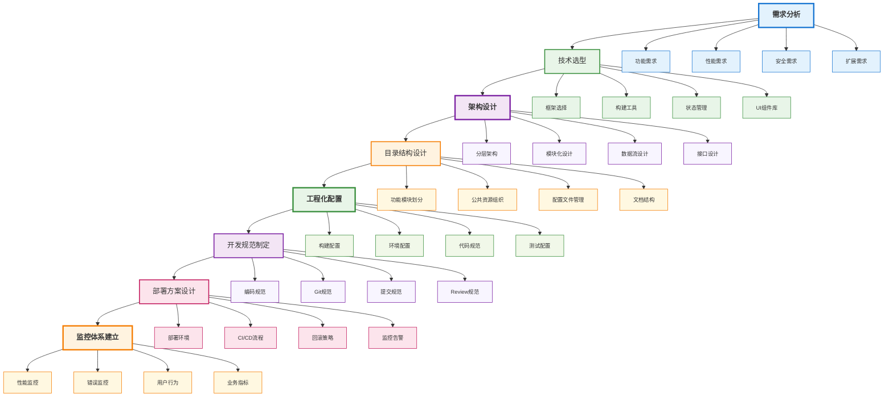
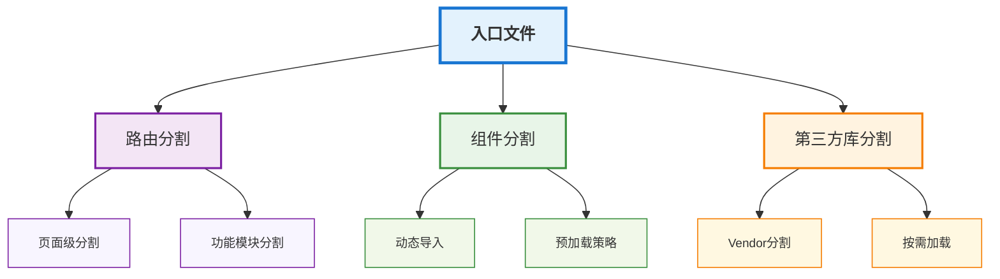
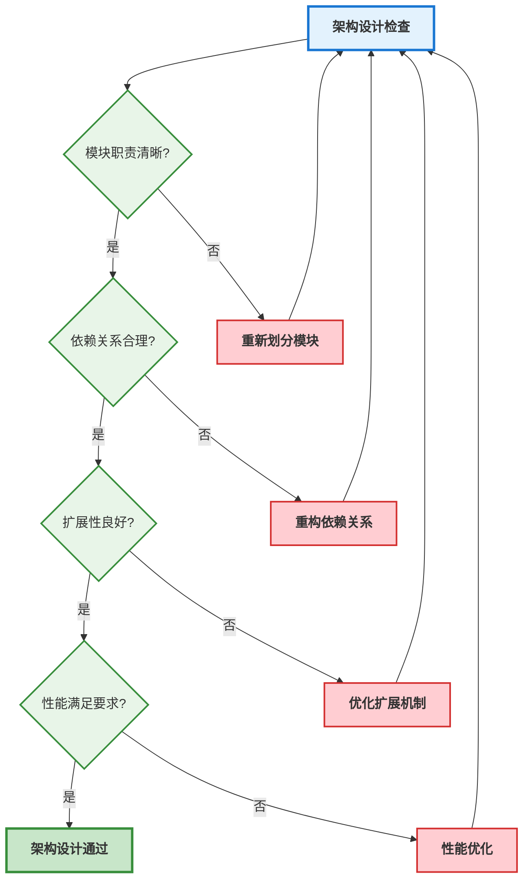

# 项目架构与工程化

## 📚 学习指导

**本章重点**：理解前端项目架构设计的核心原则和工程化实践，为后续深入学习打下坚实基础。

**学习目标**：
- 掌握项目架构设计的基本原则和方法
- 理解工程化配置的各个层面和最佳实践
- 学会设计可扩展、可维护的项目结构

**前置知识**：建议具备基本的前端开发经验，了解HTML、CSS、JavaScript基础。

**后续学习**：掌握架构设计后，建议学习 [工程化与编译原理](./compilation.md) 深入理解底层原理。

## 项目架构设计概述

前端项目架构设计是工程化的核心，它决定了项目的可维护性、可扩展性和开发效率。一个良好的架构设计能够显著提升团队协作效率和代码质量。

## 架构设计整体流程



## 1. 架构设计原则

### 1.1 单一职责原则 (SRP)

每个模块或组件应该只有一个引起它变化的原因。

```typescript
// ❌ 违反单一职责原则
class UserManager {
  // 用户管理
  createUser(userData: UserData): User { /* ... */ }
  updateUser(userId: string, userData: Partial<UserData>): User { /* ... */ }
  deleteUser(userId: string): boolean { /* ... */ }
  
  // 邮件发送 - 不应该在这里
  sendEmail(to: string, subject: string, content: string): void { /* ... */ }
  
  // 日志记录 - 不应该在这里
  logUserAction(action: string, userId: string): void { /* ... */ }
}

// ✅ 遵循单一职责原则
class UserManager {
  createUser(userData: UserData): User { /* ... */ }
  updateUser(userId: string, userData: Partial<UserData>): User { /* ... */ }
  deleteUser(userId: string): boolean { /* ... */ }
}

class EmailService {
  sendEmail(to: string, subject: string, content: string): void { /* ... */ }
}

class LoggerService {
  logUserAction(action: string, userId: string): void { /* ... */ }
}
```

### 1.2 开闭原则 (OCP)

软件实体应该对扩展开放，对修改关闭。

```typescript
// 基础支付接口
interface PaymentProcessor {
  processPayment(amount: number): Promise<PaymentResult>;
}

// 具体支付实现
class CreditCardProcessor implements PaymentProcessor {
  async processPayment(amount: number): Promise<PaymentResult> {
    // 信用卡支付逻辑
    return { success: true, transactionId: 'cc_123' };
  }
}

class PayPalProcessor implements PaymentProcessor {
  async processPayment(amount: number): Promise<PaymentResult> {
    // PayPal支付逻辑
    return { success: true, transactionId: 'pp_456' };
  }
}

// 支付服务 - 对扩展开放，对修改关闭
class PaymentService {
  constructor(private processors: PaymentProcessor[]) {}
  
  async processPayment(type: string, amount: number): Promise<PaymentResult> {
    const processor = this.processors.find(p => p.constructor.name.toLowerCase().includes(type));
    if (!processor) {
      throw new Error(`Unsupported payment type: ${type}`);
    }
    return processor.processPayment(amount);
  }
  
  // 可以轻松添加新的支付方式，无需修改现有代码
  addProcessor(processor: PaymentProcessor): void {
    this.processors.push(processor);
  }
}
```

### 1.3 依赖倒置原则 (DIP)

高层模块不应该依赖低层模块，两者都应该依赖抽象。

```typescript
// 抽象接口
interface UserRepository {
  findById(id: string): Promise<User | null>;
  save(user: User): Promise<User>;
}

interface EmailService {
  sendWelcomeEmail(user: User): Promise<void>;
}

// 具体实现
class DatabaseUserRepository implements UserRepository {
  async findById(id: string): Promise<User | null> {
    // 数据库查询实现
    return await db.users.findById(id);
  }
  
  async save(user: User): Promise<User> {
    // 数据库保存实现
    return await db.users.save(user);
  }
}

class SMTPEmailService implements EmailService {
  async sendWelcomeEmail(user: User): Promise<void> {
    // SMTP邮件发送实现
    await smtp.send({
      to: user.email,
      subject: 'Welcome!',
      content: `Welcome ${user.name}!`
    });
  }
}

// 高层业务逻辑 - 依赖抽象，不依赖具体实现
class UserRegistrationService {
  constructor(
    private userRepo: UserRepository,
    private emailService: EmailService
  ) {}
  
  async registerUser(userData: UserData): Promise<User> {
    const user = await this.userRepo.save(new User(userData));
    await this.emailService.sendWelcomeEmail(user);
    return user;
  }
}
```

## 2. 目录结构设计

### 2.1 标准目录结构

```mermaid
graph TD
    %% 主要目录 - 垂直布局，链路清晰
    A[项目根目录] --> B[src/]
    A --> C[public/]
    A --> D[config/]
    A --> E[tests/]
    A --> F[docs/]
    
    %% src目录子结构 - 右侧展开
    B --> B1[components/]
    B --> B2[pages/]
    B --> B3[services/]
    B --> B4[utils/]
    B --> B5[types/]
    B --> B6[assets/]
    B --> B7[styles/]
    
    %% components子目录 - 右侧展开
    B1 --> B1A[common/]
    B1 --> B1B[business/]
    B1 --> B1C[layout/]
    
    %% pages子目录 - 右侧展开
    B2 --> B2A[home/]
    B2 --> B2B[user/]
    B2 --> B2C[product/]
    
    %% services子目录 - 右侧展开
    B3 --> B3A[api/]
    B3 --> B3B[auth/]
    B3 --> B3C[storage/]
    
    %% public目录子结构 - 右侧展开
    C --> C1[index.html]
    C --> C2[favicon.ico]
    C --> C3[robots.txt]
    
    %% config目录子结构 - 右侧展开
    D --> D1[webpack.config.js]
    D --> D2[babel.config.js]
    D --> D3[tsconfig.json]
    D --> D4[eslint.config.js]
    
    %% tests目录子结构 - 右侧展开
    E --> E1[unit/]
    E --> E2[integration/]
    E --> E3[e2e/]
    
    %% 样式设置 - 主目录突出显示
    style A fill:#e8f5e8,stroke:#388e3c,stroke-width:3px,font-weight:bold
    
    %% 主要目录样式
    style B fill:#e3f2fd,stroke:#1976d2,stroke-width:2px
    style C fill:#fff3e0,stroke:#f57c00,stroke-width:2px
    style D fill:#f3e5f5,stroke:#7b1fa2,stroke-width:2px
    style E fill:#e8f5e8,stroke:#388e3c,stroke-width:2px
    style F fill:#fce4ec,stroke:#c2185b,stroke-width:2px
    
    %% src子目录样式
    style B1 fill:#e3f2fd,stroke:#1976d2,stroke-width:1px,font-size:12px
    style B2 fill:#e3f2fd,stroke:#1976d2,stroke-width:1px,font-size:12px
    style B3 fill:#e3f2fd,stroke:#1976d2,stroke-width:1px,font-size:12px
    style B4 fill:#e3f2fd,stroke:#1976d2,stroke-width:1px,font-size:12px
    style B5 fill:#e3f2fd,stroke:#1976d2,stroke-width:1px,font-size:12px
    style B6 fill:#e3f2fd,stroke:#1976d2,stroke-width:1px,font-size:12px
    style B7 fill:#e3f2fd,stroke:#1976d2,stroke-width:1px,font-size:12px
    
    %% 更深层子目录样式 - 淡化处理
    style B1A fill:#f8f5ff,stroke:#7b1fa2,stroke-width:1px,font-size:11px
    style B1B fill:#f8f5ff,stroke:#7b1fa2,stroke-width:1px,font-size:11px
    style B1C fill:#f8f5ff,stroke:#7b1fa2,stroke-width:1px,font-size:11px
    style B2A fill:#f8f5ff,stroke:#7b1fa2,stroke-width:1px,font-size:11px
    style B2B fill:#f8f5ff,stroke:#7b1fa2,stroke-width:1px,font-size:11px
    style B2C fill:#f8f5ff,stroke:#7b1fa2,stroke-width:1px,font-size:11px
    style B3A fill:#f8f5ff,stroke:#7b1fa2,stroke-width:1px,font-size:11px
    style B3B fill:#f8f5ff,stroke:#7b1fa2,stroke-width:1px,font-size:11px
    style B3C fill:#f8f5ff,stroke:#7b1fa2,stroke-width:1px,font-size:11px
    style C1 fill:#fff8e1,stroke:#f57c00,stroke-width:1px,font-size:11px
    style C2 fill:#fff8e1,stroke:#f57c00,stroke-width:1px,font-size:11px
    style C3 fill:#fff8e1,stroke:#f57c00,stroke-width:1px,font-size:11px
    style D1 fill:#f8f5ff,stroke:#7b1fa2,stroke-width:1px,font-size:11px
    style D2 fill:#f8f5ff,stroke:#7b1fa2,stroke-width:1px,font-size:11px
    style D3 fill:#f8f5ff,stroke:#7b1fa2,stroke-width:1px,font-size:11px
    style D4 fill:#f8f5ff,stroke:#7b1fa2,stroke-width:1px,font-size:11px
    style E1 fill:#f1f8e9,stroke:#388e3c,stroke-width:1px,font-size:11px
    style E2 fill:#f1f8e9,stroke:#388e3c,stroke-width:1px,font-size:11px
    style E3 fill:#f1f8e9,stroke:#388e3c,stroke-width:1px,font-size:11px
```



### 2.2 功能模块化目录结构

```typescript
// 功能模块化示例
src/
├── modules/
│   ├── user/
│   │   ├── components/
│   │   ├── services/
│   │   ├── types/
│   │   ├── utils/
│   │   └── index.ts
│   ├── product/
│   │   ├── components/
│   │   ├── services/
│   │   ├── types/
│   │   ├── utils/
│   │   └── index.ts
│   └── order/
│       ├── components/
│       ├── services/
│       ├── types/
│       ├── utils/
│       └── index.ts
├── shared/
│   ├── components/
│   ├── services/
│   ├── types/
│   └── utils/
└── app/
    ├── components/
    ├── services/
    └── types/
```

## 3. 工程化配置管理

### 3.1 环境配置管理

```typescript
// 环境配置接口
interface EnvironmentConfig {
  apiBaseUrl: string;
  appName: string;
  version: string;
  debug: boolean;
  features: {
    analytics: boolean;
    monitoring: boolean;
    caching: boolean;
  };
}

// 环境配置管理器
class EnvironmentManager {
  private config: EnvironmentConfig;
  
  constructor() {
    this.config = this.loadConfig();
  }
  
  private loadConfig(): EnvironmentConfig {
    const env = process.env.NODE_ENV || 'development';
    
    switch (env) {
      case 'production':
        return {
          apiBaseUrl: 'https://api.production.com',
          appName: 'MyApp',
          version: '1.0.0',
          debug: false,
          features: {
            analytics: true,
            monitoring: true,
            caching: true
          }
        };
      
      case 'staging':
        return {
          apiBaseUrl: 'https://api.staging.com',
          appName: 'MyApp-Staging',
          version: '1.0.0-beta',
          debug: true,
          features: {
            analytics: true,
            monitoring: true,
            caching: false
          }
        };
      
      default: // development
        return {
          apiBaseUrl: 'http://localhost:3000',
          appName: 'MyApp-Dev',
          version: '1.0.0-dev',
          debug: true,
          features: {
            analytics: false,
            monitoring: false,
            caching: false
          }
        };
    }
  }
  
  get<K extends keyof EnvironmentConfig>(key: K): EnvironmentConfig[K] {
    return this.config[key];
  }
  
  getAll(): EnvironmentConfig {
    return { ...this.config };
  }
  
  isProduction(): boolean {
    return process.env.NODE_ENV === 'production';
  }
  
  isDevelopment(): boolean {
    return process.env.NODE_ENV === 'development';
  }
}

// 使用示例
const env = new EnvironmentManager();
const apiUrl = env.get('apiBaseUrl');
const isDebug = env.get('debug');
```

### 3.2 构建配置管理

```typescript
// 构建配置接口
interface BuildConfig {
  entry: string;
  output: {
    path: string;
    filename: string;
    publicPath: string;
  };
  optimization: {
    minimize: boolean;
    splitChunks: boolean;
    treeShaking: boolean;
  };
  plugins: string[];
}

// 构建配置管理器
class BuildConfigManager {
  private config: BuildConfig;
  
  constructor(env: string) {
    this.config = this.generateConfig(env);
  }
  
  private generateConfig(env: string): BuildConfig {
    const baseConfig: BuildConfig = {
      entry: './src/index.ts',
      output: {
        path: './dist',
        filename: '[name].[contenthash].js',
        publicPath: '/'
      },
      optimization: {
        minimize: false,
        splitChunks: false,
        treeShaking: false
      },
      plugins: []
    };
    
    if (env === 'production') {
      baseConfig.optimization.minimize = true;
      baseConfig.optimization.splitChunks = true;
      baseConfig.optimization.treeShaking = true;
      baseConfig.plugins.push('compression', 'minification');
    }
    
    return baseConfig;
  }
  
  getConfig(): BuildConfig {
    return { ...this.config };
  }
  
  updateConfig(updates: Partial<BuildConfig>): void {
    this.config = { ...this.config, ...updates };
  }
  
  addPlugin(plugin: string): void {
    if (!this.config.plugins.includes(plugin)) {
      this.config.plugins.push(plugin);
    }
  }
}
```

## 4. 性能优化策略

### 4.1 代码分割策略



```typescript
// 代码分割实现
class CodeSplittingManager {
  // 路由级代码分割
  static createRouteChunk(routePath: string) {
    return () => import(`@/pages${routePath}`);
  }
  
  // 组件级代码分割
  static createComponentChunk(componentPath: string) {
    return () => import(`@/components${componentPath}`);
  }
  
  // 预加载策略
  static preloadRoute(routePath: string): void {
    const link = document.createElement('link');
    link.rel = 'prefetch';
    link.href = `/chunks${routePath}.js`;
    document.head.appendChild(link);
  }
  
  // 智能预加载
  static smartPreload(currentRoute: string): void {
    const routeMap = {
      '/home': ['/products', '/about'],
      '/products': ['/product-detail', '/cart'],
      '/cart': ['/checkout', '/payment']
    };
    
    const routesToPreload = routeMap[currentRoute as keyof typeof routeMap] || [];
    routesToPreload.forEach(route => this.preloadRoute(route));
  }
}

// 使用示例
const HomePage = CodeSplittingManager.createRouteChunk('/home');
const ProductCard = CodeSplittingManager.createComponentChunk('/product/Card');

// 预加载相关路由
CodeSplittingManager.smartPreload('/home');
```

### 4.2 缓存策略

```typescript
// 缓存策略管理器
class CacheStrategyManager {
  private cache = new Map<string, { data: any; timestamp: number; ttl: number }>();
  
  // 设置缓存
  set(key: string, data: any, ttl: number = 5 * 60 * 1000): void {
    this.cache.set(key, {
      data,
      timestamp: Date.now(),
      ttl
    });
  }
  
  // 获取缓存
  get(key: string): any | null {
    const cached = this.cache.get(key);
    if (!cached) return null;
    
    // 检查是否过期
    if (Date.now() - cached.timestamp > cached.ttl) {
      this.cache.delete(key);
      return null;
    }
    
    return cached.data;
  }
  
  // 清除过期缓存
  clearExpired(): void {
    const now = Date.now();
    for (const [key, cached] of this.cache.entries()) {
      if (now - cached.timestamp > cached.ttl) {
        this.cache.delete(key);
      }
    }
  }
  
  // 清除所有缓存
  clear(): void {
    this.cache.clear();
  }
  
  // 获取缓存统计
  getStats(): { total: number; expired: number; valid: number } {
    const now = Date.now();
    let expired = 0;
    let valid = 0;
    
    for (const cached of this.cache.values()) {
      if (now - cached.timestamp > cached.ttl) {
        expired++;
      } else {
        valid++;
      }
    }
    
    return {
      total: this.cache.size,
      expired,
      valid
    };
  }
}
```

## 5. 监控与日志

### 5.1 性能监控

```typescript
// 性能监控器
class PerformanceMonitor {
  private metrics: Map<string, number[]> = new Map();
  
  // 监控页面加载性能
  monitorPageLoad(): void {
    if ('PerformanceObserver' in window) {
      const observer = new PerformanceObserver((list) => {
        for (const entry of list.getEntries()) {
          this.recordMetric('pageLoad', entry.duration);
        }
      });
      
      observer.observe({ entryTypes: ['navigation'] });
    }
  }
  
  // 监控资源加载性能
  monitorResourceLoad(): void {
    if ('PerformanceObserver' in window) {
      const observer = new PerformanceObserver((list) => {
        for (const entry of list.getEntries()) {
          this.recordMetric('resourceLoad', entry.duration);
        }
      });
      
      observer.observe({ entryTypes: ['resource'] });
    }
  }
  
  // 记录性能指标
  private recordMetric(name: string, value: number): void {
    if (!this.metrics.has(name)) {
      this.metrics.set(name, []);
    }
    this.metrics.get(name)!.push(value);
  }
  
  // 获取性能统计
  getMetrics(name: string): { avg: number; min: number; max: number; count: number } {
    const values = this.metrics.get(name) || [];
    if (values.length === 0) {
      return { avg: 0, min: 0, max: 0, count: 0 };
    }
    
    const sum = values.reduce((acc, val) => acc + val, 0);
    const avg = sum / values.length;
    const min = Math.min(...values);
    const max = Math.max(...values);
    
    return { avg, min, max, count: values.length };
  }
  
  // 发送性能数据到监控服务
  sendMetrics(): void {
    const data = {};
    for (const [name, values] of this.metrics.entries()) {
      data[name] = this.getMetrics(name);
    }
    
    // 发送到监控服务
    fetch('/api/metrics', {
      method: 'POST',
      headers: { 'Content-Type': 'application/json' },
      body: JSON.stringify(data)
    });
  }
}
```

## 6. 最佳实践总结

### 6.1 架构设计检查清单



### 6.2 工程化配置最佳实践

1. **环境隔离**：确保开发、测试、生产环境的完全隔离
2. **配置集中化**：将所有配置集中管理，避免散落在各个文件中
3. **自动化部署**：建立完整的CI/CD流程，减少人工操作
4. **监控告警**：建立完善的监控体系，及时发现问题
5. **文档维护**：保持文档的及时更新，便于团队协作

## 总结

项目架构与工程化是前端开发的基础，良好的架构设计能够：

- **提升开发效率**：清晰的模块划分和职责分离
- **增强可维护性**：合理的依赖关系和扩展机制
- **保证代码质量**：完善的工程化配置和规范体系
- **支持团队协作**：标准化的开发流程和工具链

掌握这些原则和实践，将帮助您构建出高质量、可扩展的前端项目。在后续学习中，我们将深入探讨编译原理、构建工具等更底层的技术细节。 