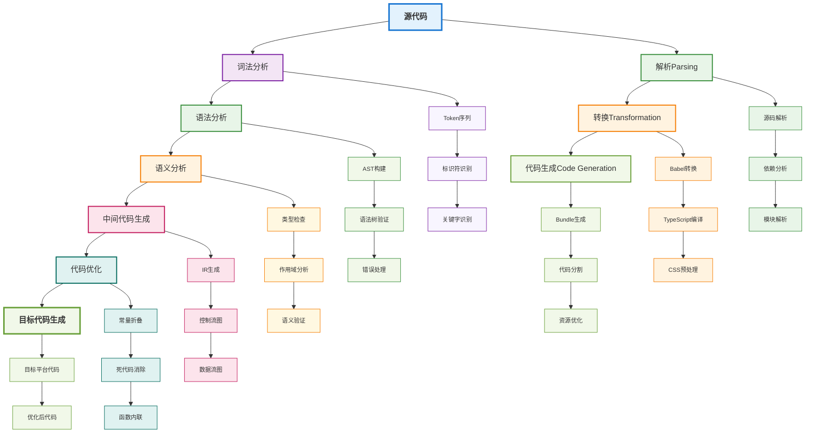
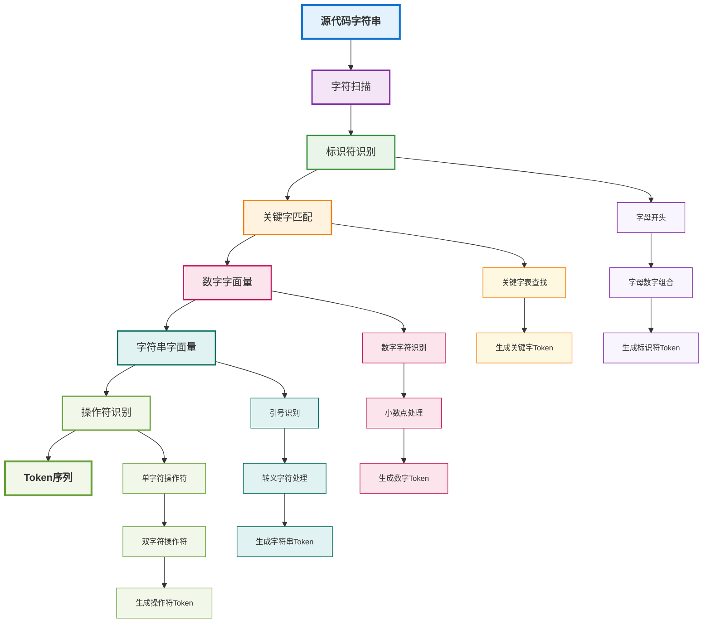
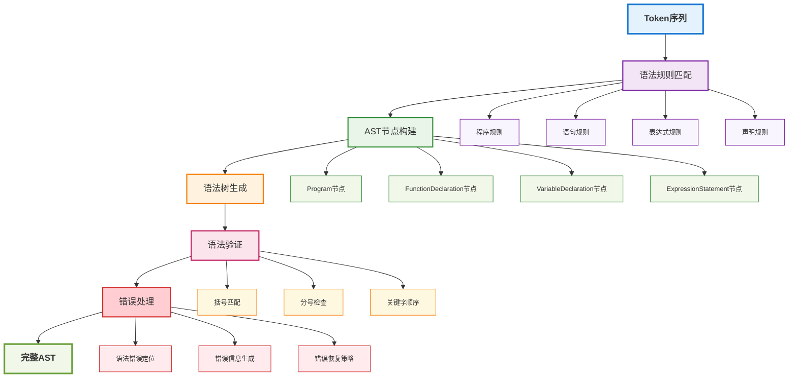
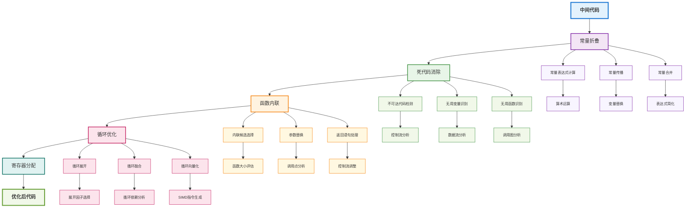
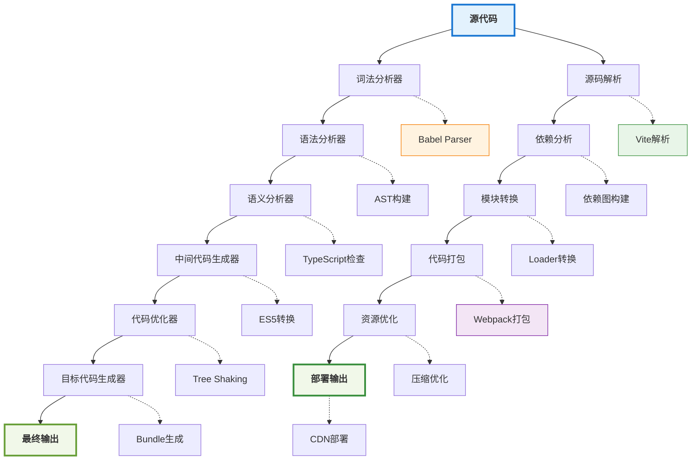

# 工程化与编译原理详解

## 📚 学习指导

**本章重点**：理解编译原理在工程化中的应用，掌握现代构建工具的工作原理。

**学习目标**：
- 掌握传统编译流程和前端编译流程的区别
- 理解词法分析、语法分析、语义分析等核心概念
- 学会应用编译原理优化构建流程

**前置知识**：建议先阅读 [项目架构与工程化](./architecture.md) 了解工程化基础。

**后续学习**：掌握编译原理后，建议学习 [Vite构建原理与源码剖析](./vite-deep-dive.md) 深入理解构建工具。

## 编译原理概述

编译原理是计算机科学的基础理论，在前端工程化中扮演着核心角色。理解编译原理有助于我们更好地使用和优化构建工具，解决复杂的工程化问题。

## 编译流程整体架构



## 编译过程概述

### 传统编译流程
```
源代码 → 词法分析 → 语法分析 → 语义分析 → 中间代码生成 → 代码优化 → 目标代码生成
```

### 前端编译流程
```
源代码 → 解析(Parsing) → 转换(Transformation) → 代码生成(Code Generation)
```

## 编译阶段详细流程

### 1. 词法分析阶段



### 2. 语法分析阶段



## 词法分析 (Lexical Analysis)

### 概念
将源代码字符串分解为有意义的标记(Token)序列的过程。

### 在前端工程化中的应用

#### 1. JavaScript解析
```typescript
// 词法分析器示例
class Lexer {
  private input: string;
  private position: number = 0;
  
  constructor(input: string) {
    this.input = input;
  }
  
  nextToken(): Token {
    this.skipWhitespace();
    
    if (this.position >= this.input.length) {
      return { type: 'EOF', value: '' };
    }
    
    const char = this.input[this.position];
    
    if (char === '"' || char === "'") {
      return this.readString();
    }
    
    if (this.isDigit(char)) {
      return this.readNumber();
    }
    
    if (this.isLetter(char)) {
      return this.readIdentifier();
    }
    
    return this.readOperator();
  }
}
```

#### 2. CSS解析
- 解析选择器、属性、值
- 处理媒体查询和关键帧动画
- 支持预处理器语法(Sass、Less)

#### 3. 模板解析
- Vue模板解析为AST
- JSX转换为函数调用
- 自定义模板语法支持

## 语法分析 (Syntax Analysis)

### 概念
根据语法规则将Token序列构建成抽象语法树(AST)的过程。

### AST在前端工程化中的应用

#### 1. 代码转换
```typescript
// AST转换示例
interface ASTNode {
  type: string;
  [key: string]: any;
}

class ASTTransformer {
  transform(node: ASTNode): ASTNode {
    switch (node.type) {
      case 'FunctionDeclaration':
        return this.transformFunctionDeclaration(node);
      case 'VariableDeclaration':
        return this.transformVariableDeclaration(node);
      default:
        return node;
    }
  }
  
  private transformFunctionDeclaration(node: ASTNode): ASTNode {
    // 转换函数声明为箭头函数
    if (node.kind === 'function') {
      return {
        type: 'VariableDeclaration',
        kind: 'const',
        declarations: [{
          type: 'VariableDeclarator',
          id: node.id,
          init: {
            type: 'ArrowFunctionExpression',
            params: node.params,
            body: node.body
          }
        }]
      };
    }
    return node;
  }
}
```

#### 2. 代码优化
- 死代码消除
- 常量折叠
- 函数内联

#### 3. 代码生成
- ES6+转ES5
- TypeScript转JavaScript
- 模块化代码转换

## 语义分析 (Semantic Analysis)

### 概念
检查程序的语义正确性，包括类型检查、作用域分析等。

### 语义分析流程

```mermaid
flowchart TD
    %% 主要流程 - 垂直布局，链路清晰
    A[AST] --> B[作用域分析]
    B --> C[类型检查]
    C --> D[语义验证]
    D --> E[符号表构建]
    E --> F[语义正确的AST]
    
    %% 作用域分析子流程 - 右侧展开
    B --> B1[全局作用域]
    B --> B2[函数作用域]
    B --> B3[块级作用域]
    B1 --> B4[变量声明检查]
    B2 --> B5[参数作用域]
    B3 --> B6[临时变量作用域]
    
    %% 类型检查子流程 - 右侧展开
    C --> C1[基本类型检查]
    C --> C2[函数类型检查]
    C --> C3[数组类型检查]
    C --> C4[对象类型检查]
    C1 --> C5[类型兼容性]
    C2 --> C6[参数类型匹配]
    
    %% 语义验证子流程 - 右侧展开
    D --> D1[变量使用前声明]
    D --> D2[函数调用匹配]
    D --> D3[表达式类型一致]
    D --> D4[控制流完整性]
    
    %% 符号表子流程 - 右侧展开
    E --> E1[变量符号]
    E --> E2[函数符号]
    E --> E3[类型符号]
    E --> E4[作用域链]
    
    %% 样式设置 - 主流程突出显示
    style A fill:#e3f2fd,stroke:#1976d2,stroke-width:3px,font-weight:bold
    style F fill:#f1f8e9,stroke:#689f38,stroke-width:3px,font-weight:bold
    
    %% 主流程节点样式
    style B fill:#f3e5f5,stroke:#7b1fa2,stroke-width:2px
    style C fill:#e8f5e8,stroke:#388e3c,stroke-width:2px
    style D fill:#fff3e0,stroke:#f57c00,stroke-width:2px
    style E fill:#fce4ec,stroke:#c2185b,stroke-width:2px
    
    %% 子流程样式 - 淡化处理
    style B1 fill:#f8f5ff,stroke:#7b1fa2,stroke-width:1px,font-size:12px
    style B2 fill:#f8f5ff,stroke:#7b1fa2,stroke-width:1px,font-size:12px
    style B3 fill:#f8f5ff,stroke:#7b1fa2,stroke-width:1px,font-size:12px
    style B4 fill:#f8f5ff,stroke:#7b1fa2,stroke-width:1px,font-size:12px
    style B5 fill:#f8f5ff,stroke:#7b1fa2,stroke-width:1px,font-size:12px
    style B6 fill:#f8f5ff,stroke:#7b1fa2,stroke-width:1px,font-size:12px
    style C1 fill:#f1f8e9,stroke:#388e3c,stroke-width:1px,font-size:12px
    style C2 fill:#f1f8e9,stroke:#388e3c,stroke-width:1px,font-size:12px
    style C3 fill:#f1f8e9,stroke:#388e3c,stroke-width:1px,font-size:12px
    style C4 fill:#f1f8e9,stroke:#388e3c,stroke-width:1px,font-size:12px
    style C5 fill:#f1f8e9,stroke:#388e3c,stroke-width:1px,font-size:12px
    style C6 fill:#f1f8e9,stroke:#388e3c,stroke-width:1px,font-size:12px
    style D1 fill:#fff8e1,stroke:#f57c00,stroke-width:1px,font-size:12px
    style D2 fill:#fff8e1,stroke:#f57c00,stroke-width:1px,font-size:12px
    style D3 fill:#fff8e1,stroke:#f57c00,stroke-width:1px,font-size:12px
    style D4 fill:#fff8e1,stroke:#f57c00,stroke-width:1px,font-size:12px
    style E1 fill:#fce4ec,stroke:#c2185b,stroke-width:1px,font-size:12px
    style E2 fill:#fce4ec,stroke:#c2185b,stroke-width:1px,font-size:12px
    style E3 fill:#fce4ec,stroke:#c2185b,stroke-width:1px,font-size:12px
    style E4 fill:#fce4ec,stroke:#c2185b,stroke-width:1px,font-size:12px
```



### 在前端工程化中的应用

#### 1. TypeScript类型检查
```typescript
// 类型检查器示例
interface TypeChecker {
  checkType(node: ASTNode, context: TypeContext): Type;
}

class TypeScriptChecker implements TypeChecker {
  checkType(node: ASTNode, context: TypeContext): Type {
    switch (node.type) {
      case 'BinaryExpression':
        return this.checkBinaryExpression(node, context);
      case 'CallExpression':
        return this.checkCallExpression(node, context);
      default:
        return this.checkDefault(node, context);
    }
  }
  
  private checkBinaryExpression(node: ASTNode, context: TypeContext): Type {
    const leftType = this.checkType(node.left, context);
    const rightType = this.checkType(node.right, context);
    
    // 类型兼容性检查
    if (!this.isCompatible(leftType, rightType)) {
      throw new TypeError(`Type mismatch: ${leftType} vs ${rightType}`);
    }
    
    return this.getResultType(node.operator, leftType, rightType);
  }
}
```

#### 2. ESLint规则检查
- 代码风格检查
- 潜在错误检测
- 最佳实践建议

#### 3. 依赖分析
- 模块依赖关系
- 循环依赖检测
- 外部依赖管理

## 中间代码生成

### 概念
将AST转换为中间表示形式，便于后续优化和代码生成。

### 在前端工程化中的应用

#### 1. Babel AST转换
```typescript
// Babel插件示例
export default function() {
  return {
    visitor: {
      // 转换箭头函数
      ArrowFunctionExpression(path) {
        const { node } = path;
        
        // 创建函数表达式
        const functionExpression = t.functionExpression(
          null,
          node.params,
          node.body,
          node.generator,
          node.async
        );
        
        path.replaceWith(functionExpression);
      },
      
      // 转换类属性
      ClassProperty(path) {
        const { node } = path;
        
        if (node.static && node.value && t.isFunction(node.value)) {
          // 静态方法转换为类方法
          const methodDefinition = t.classMethod(
            'method',
            node.key,
            node.params,
            node.body,
            node.computed,
            node.static
          );
          
          path.replaceWith(methodDefinition);
        }
      }
    }
  };
}
```

#### 2. 代码分割优化
- 动态导入分析
- 公共代码提取
- 按需加载优化

## 代码优化

### 概念
对中间代码进行各种优化，提升执行效率和代码质量。

### 代码优化流程



### 优化策略

#### 1. 常量折叠
```typescript
// 常量折叠示例
const a = 1 + 2;        // 优化为: const a = 3;
const b = "Hello" + " World"; // 优化为: const b = "Hello World";
```

#### 2. 死代码消除
```typescript
// 死代码消除示例
if (false) {
  console.log("This will never execute"); // 被消除
}

function unusedFunction() { // 被消除
  return "unused";
}
```

#### 3. 函数内联
```typescript
// 函数内联示例
function add(a: number, b: number): number {
  return a + b;
}

const result = add(1, 2);
// 优化为: const result = 1 + 2;
```

## 代码生成

### 概念
将优化后的中间代码转换为目标代码。

### 在前端工程化中的应用

#### 1. 多目标输出
```typescript
// 代码生成器示例
interface CodeGenerator {
  generate(ast: ASTNode, target: Target): string;
}

class JavaScriptGenerator implements CodeGenerator {
  generate(ast: ASTNode, target: Target): string {
    switch (target) {
      case 'es5':
        return this.generateES5(ast);
      case 'es2015':
        return this.generateES2015(ast);
      case 'es2020':
        return this.generateES2020(ast);
      default:
        return this.generateES5(ast);
    }
  }
  
  private generateES5(ast: ASTNode): string {
    // 将ES6+语法转换为ES5
    return this.transformAST(ast, ES5Transformers);
  }
}
```

#### 2. 源码映射
- 生成Source Map
- 调试信息保留
- 错误定位支持

## 现代构建工具中的编译原理

### 1. Vite
- **开发环境**：ESM原生支持，无需编译
- **生产环境**：Rollup进行代码打包和优化
- **HMR**：基于ESM的模块热更新

### 2. Webpack
- **Loader系统**：文件级别的转换管道
- **Plugin系统**：构建过程的钩子机制
- **代码分割**：基于依赖图的动态导入

### 3. Rollup
- **Tree Shaking**：基于ESM的静态分析
- **插件系统**：AST级别的转换能力
- **输出格式**：支持多种模块规范

## 性能优化策略

### 1. 增量编译
- 只编译变更的文件
- 缓存编译结果
- 并行编译处理

### 2. 编译缓存
```typescript
// 编译缓存示例
class CompilationCache {
  private cache = new Map<string, CompilationResult>();
  
  get(key: string): CompilationResult | undefined {
    return this.cache.get(key);
  }
  
  set(key: string, result: CompilationResult): void {
    this.cache.set(key, result);
  }
  
  invalidate(pattern: string): void {
    for (const key of this.cache.keys()) {
      if (key.match(pattern)) {
        this.cache.delete(key);
      }
    }
  }
}
```

### 3. 并行处理
- 多进程编译
- 任务队列优化
- 资源池管理

## 实际应用场景

### 1. 代码转换
- ES6+转ES5兼容性
- JSX/TSX转换
- CSS预处理器编译

### 2. 代码检查
- 语法错误检测
- 代码风格统一
- 潜在问题预警

### 3. 代码优化
- 体积优化
- 性能优化
- 兼容性处理

## 编译原理在工程化中的应用总结

### 完整编译流程回顾



### 编译原理与构建工具的对应关系

| 编译阶段 | 构建工具 | 具体实现 |
|---------|---------|---------|
| **词法分析** | Babel | @babel/parser |
| **语法分析** | TypeScript | ts.parse() |
| **语义分析** | ESLint | AST遍历规则 |
| **代码转换** | Webpack | Loader系统 |
| **代码优化** | Rollup | Tree Shaking |
| **代码生成** | Vite | esbuild |

## 总结

编译原理是前端工程化的理论基础，理解这些概念有助于：

1. **更好地使用构建工具**：了解工具的工作原理和配置选项
2. **解决复杂问题**：遇到构建问题时能够快速定位和解决
3. **优化构建性能**：通过理解编译过程来优化构建配置
4. **开发自定义工具**：基于编译原理开发特定的构建工具

在实际工作中，我们不需要实现完整的编译器，但理解这些原理能够帮助我们更好地使用现有的工程化工具，提升开发效率和代码质量。

### 🎯 学习建议

- **理论结合实践**：理解原理后，动手实践各种构建工具
- **源码阅读**：尝试阅读Babel、Webpack等工具的源码
- **工具对比**：对比不同构建工具的实现差异
- **性能分析**：使用工具分析构建过程的性能瓶颈

### 🚀 进阶方向

- **自定义Loader**：基于AST开发Webpack Loader
- **Babel插件**：开发代码转换插件
- **构建工具**：设计自己的构建工具
- **性能优化**：深入优化构建性能

掌握编译原理，将让您在工程化领域更加游刃有余！ 