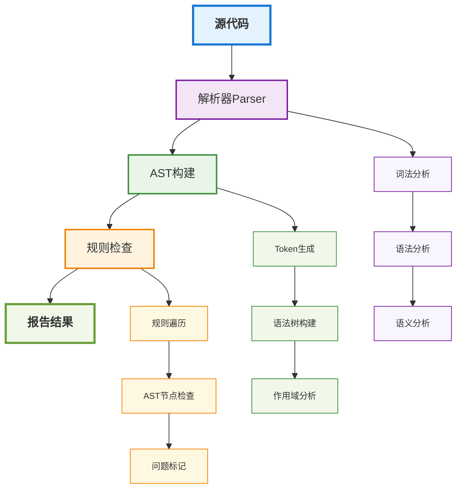

# ESLint编码规范与原理解析

## 概述

ESLint是JavaScript和TypeScript代码质量检查工具，它通过静态分析代码来发现潜在问题、强制执行编码规范、提高代码质量。本文将深入分析ESLint的工作原理、配置方法和最佳实践。

## ESLint核心概念

### 1. 工作原理

ESLint通过以下步骤进行代码检查：



#### 解析过程
```typescript
// ESLint解析流程
class ESLintParser {
  async parse(code: string, options: ParserOptions): Promise<AST> {
    // 1. 词法分析
    const tokens = this.tokenize(code);
    
    // 2. 语法分析
    const ast = this.parseTokens(tokens);
    
    // 3. 语义分析
    this.validateAST(ast);
    
    return ast;
  }
  
  private tokenize(code: string): Token[] {
    // 将源代码分解为标记
    return this.lexer.tokenize(code);
  }
  
  private parseTokens(tokens: Token[]): AST {
    // 将标记构建为抽象语法树
    return this.parser.parse(tokens);
  }
}
```

### 2. AST结构

ESLint使用ESTree规范的AST结构：

```typescript
// AST节点类型
interface ASTNode {
  type: string;
  loc: SourceLocation;
  range: [number, number];
  [key: string]: any;
}

// 函数声明节点
interface FunctionDeclaration extends ASTNode {
  type: 'FunctionDeclaration';
  id: Identifier;
  params: Pattern[];
  body: BlockStatement;
  generator: boolean;
  async: boolean;
}

// 变量声明节点
interface VariableDeclaration extends ASTNode {
  type: 'VariableDeclaration';
  declarations: VariableDeclarator[];
  kind: 'var' | 'let' | 'const';
}
```

## 规则系统

### 1. 规则类型

#### 基础规则
```typescript
// 基础规则接口
interface Rule {
  meta: RuleMetaData;
  create(context: RuleContext): RuleListener;
}

// 规则元数据
interface RuleMetaData {
  type: 'problem' | 'suggestion' | 'layout';
  docs: {
    description: string;
    category: string;
    recommended: boolean;
  };
  fixable?: 'code' | 'whitespace';
  schema?: JSONSchema4[];
  deprecated?: boolean;
  replacedBy?: string[];
}
```

#### 规则上下文
```typescript
// 规则上下文
interface RuleContext {
  id: string;
  options: any[];
  settings: { [key: string]: any };
  parserPath: string;
  parserOptions: Linter.ParserOptions;
  
  // 报告方法
  report(descriptor: ReportDescriptor): void;
  
  // 获取源代码
  getSourceCode(): SourceCode;
  
  // 获取作用域
  getScope(): Scope;
  
  // 获取注释
  getComments(node: ASTNode): Comment[];
}
```

### 2. 自定义规则开发

#### 基础规则示例
```typescript
// 自定义规则：禁止使用console.log
module.exports = {
  meta: {
    type: 'suggestion',
    docs: {
      description: 'Disallow console.log statements',
      category: 'Best Practices',
      recommended: true
    },
    fixable: 'code',
    schema: []
  },
  
  create(context) {
    return {
      CallExpression(node) {
        if (
          node.callee.type === 'MemberExpression' &&
          node.callee.object.type === 'Identifier' &&
          node.callee.object.name === 'console' &&
          node.callee.property.type === 'Identifier' &&
          node.callee.property.name === 'log'
        ) {
          context.report({
            node,
            message: 'Unexpected console.log statement.',
            fix(fixer) {
              return fixer.remove(node);
            }
          });
        }
      }
    };
  }
};
```

#### 高级规则示例
```typescript
// 自定义规则：强制使用async/await
module.exports = {
  meta: {
    type: 'suggestion',
    docs: {
      description: 'Enforce async/await instead of .then()',
      category: 'Best Practices'
    },
    fixable: 'code',
    schema: []
  },
  
  create(context) {
    return {
      CallExpression(node) {
        if (
          node.callee.type === 'MemberExpression' &&
          node.callee.property.type === 'Identifier' &&
          node.callee.property.name === 'then'
        ) {
          context.report({
            node,
            message: 'Use async/await instead of .then()',
            suggest: [
              {
                desc: 'Convert to async/await',
                fix: (fixer) => this.convertToAsyncAwait(fixer, node)
              }
            ]
          });
        }
      }
    };
  },
  
  convertToAsyncAwait(fixer, node) {
    // 复杂的转换逻辑
    const parent = node.parent;
    if (parent.type === 'ArrowFunctionExpression') {
      // 转换为async箭头函数
      return fixer.replaceText(parent, `async ${parent.params.map(p => p.name).join(', ')} => {
        const result = await ${this.getSourceCode().getText(node.callee.object)};
        ${parent.body.body.map(body => this.getSourceCode().getText(body)).join('\n')}
      }`);
    }
    return null;
  }
};
```

## 配置系统

### 1. 配置文件结构

#### 基础配置
```javascript
// .eslintrc.js
module.exports = {
  // 环境配置
  env: {
    browser: true,
    es2021: true,
    node: true
  },
  
  // 解析器配置
  parser: '@typescript-eslint/parser',
  parserOptions: {
    ecmaVersion: 'latest',
    sourceType: 'module',
    ecmaFeatures: {
      jsx: true
    }
  },
  
  // 插件配置
  plugins: [
    '@typescript-eslint',
    'react',
    'react-hooks'
  ],
  
  // 规则配置
  rules: {
    'no-console': 'warn',
    'no-unused-vars': 'error',
    '@typescript-eslint/no-explicit-any': 'warn'
  },
  
  // 扩展配置
  extends: [
    'eslint:recommended',
    '@typescript-eslint/recommended',
    'plugin:react/recommended'
  ]
};
```

#### 高级配置
```javascript
// 复杂配置示例
module.exports = {
  // 多环境配置
  overrides: [
    {
      files: ['**/*.ts', '**/*.tsx'],
      parser: '@typescript-eslint/parser',
      plugins: ['@typescript-eslint'],
      rules: {
        '@typescript-eslint/no-unused-vars': 'error'
      }
    },
    {
      files: ['**/*.test.ts', '**/*.spec.ts'],
      env: {
        jest: true
      },
      rules: {
        'no-console': 'off'
      }
    }
  ],
  
  // 全局变量
  globals: {
    process: 'readonly',
    __dirname: 'readonly',
    __filename: 'readonly'
  },
  
  // 忽略模式
  ignorePatterns: [
    'dist/',
    'node_modules/',
    '*.min.js'
  ]
};
```

### 2. 配置继承与覆盖

#### 配置继承链
```javascript
// 基础配置
// eslint-config-base/index.js
module.exports = {
  env: { es2021: true },
  extends: ['eslint:recommended'],
  rules: {
    'no-console': 'warn',
    'no-debugger': 'error'
  }
};

// 项目特定配置
// .eslintrc.js
module.exports = {
  extends: ['./eslint-config-base'],
  rules: {
    'no-console': 'error', // 覆盖基础配置
    'no-alert': 'warn'     // 新增规则
  }
};
```

#### 配置优先级
```javascript
// 配置优先级（从高到低）
module.exports = {
  // 1. 命令行参数
  // eslint --rule 'no-console: error'
  
  // 2. 配置文件中的rules
  rules: {
    'no-console': 'error'
  },
  
  // 3. extends中的配置
  extends: ['eslint:recommended'],
  
  // 4. 默认配置
  // eslint内置规则
};
```

## 插件系统

### 1. 插件开发

#### 插件结构
```typescript
// 插件入口文件
module.exports = {
  rules: {
    'custom-rule': require('./rules/custom-rule')
  },
  
  configs: {
    recommended: {
      plugins: ['my-plugin'],
      rules: {
        'my-plugin/custom-rule': 'error'
      }
    }
  },
  
  processors: {
    '.custom': require('./processors/custom-processor')
  }
};
```

#### 处理器开发
```typescript
// 自定义文件处理器
module.exports = {
  preprocess(text, filename) {
    // 预处理文件内容
    const processedText = this.transformCustomSyntax(text);
    
    return [{
      text: processedText,
      filename: filename
    }];
  },
  
  postprocess(messages, filename) {
    // 后处理ESLint消息
    return messages[0].map(message => ({
      ...message,
      ruleId: `my-plugin/${message.ruleId}`
    }));
  },
  
  supportsAutofix: true
};
```

### 2. 常用插件

#### TypeScript插件
```javascript
// @typescript-eslint/eslint-plugin
module.exports = {
  plugins: ['@typescript-eslint'],
  extends: [
    'plugin:@typescript-eslint/recommended',
    'plugin:@typescript-eslint/recommended-requiring-type-checking'
  ],
  parserOptions: {
    project: './tsconfig.json'
  },
  rules: {
    '@typescript-eslint/no-unused-vars': 'error',
    '@typescript-eslint/explicit-function-return-type': 'warn',
    '@typescript-eslint/no-explicit-any': 'error'
  }
};
```

#### React插件
```javascript
// eslint-plugin-react
module.exports = {
  plugins: ['react', 'react-hooks'],
  extends: [
    'plugin:react/recommended',
    'plugin:react-hooks/recommended'
  ],
  rules: {
    'react/prop-types': 'off',
    'react/react-in-jsx-scope': 'off',
    'react-hooks/rules-of-hooks': 'error',
    'react-hooks/exhaustive-deps': 'warn'
  },
  settings: {
    react: {
      version: 'detect'
    }
  }
};
```

## 集成与工作流

### 1. 编辑器集成

#### VS Code集成
```json
// .vscode/settings.json
{
  "eslint.enable": true,
  "eslint.validate": [
    "javascript",
    "javascriptreact",
    "typescript",
    "typescriptreact"
  ],
  "eslint.workingDirectories": ["./frontend", "./backend"],
  "eslint.format.enable": true,
  "editor.codeActionsOnSave": {
    "source.fixAll.eslint": true
  }
}
```

#### WebStorm集成
```javascript
// 项目配置
// 1. 启用ESLint
// 2. 配置ESLint包路径
// 3. 设置自动修复
// 4. 配置代码检查
```

### 2. CI/CD集成

#### GitHub Actions
```yaml
# .github/workflows/eslint.yml
name: ESLint
on: [push, pull_request]
jobs:
  lint:
    runs-on: ubuntu-latest
    steps:
      - uses: actions/checkout@v3
      - uses: actions/setup-node@v3
        with:
          node-version: '18'
      - run: npm ci
      - run: npm run lint
      - run: npm run lint:fix
```

#### Git Hooks
```javascript
// package.json
{
  "husky": {
    "hooks": {
      "pre-commit": "lint-staged"
    }
  },
  "lint-staged": {
    "*.{js,ts,tsx}": [
      "eslint --fix",
      "git add"
    ]
  }
}
```

## 性能优化

### 1. 缓存策略

#### 文件缓存
```javascript
// .eslintrc.js
module.exports = {
  cache: true,
  cacheLocation: '.eslintcache',
  cacheStrategy: 'content'
};
```

#### 增量检查
```javascript
// 只检查变更的文件
const { execSync } = require('child_process');

function getChangedFiles() {
  const output = execSync('git diff --name-only HEAD~1', { encoding: 'utf8' });
  return output.split('\n').filter(file => 
    file.match(/\.(js|ts|tsx)$/) && !file.includes('node_modules')
  );
}

const changedFiles = getChangedFiles();
if (changedFiles.length > 0) {
  execSync(`npx eslint ${changedFiles.join(' ')}`);
}
```

### 2. 并行处理

#### 多进程检查
```javascript
// 使用eslint-parallel
const { ESLint } = require('eslint');

async function parallelLint() {
  const eslint = new ESLint({
    useEslintrc: true,
    cache: true,
    cacheLocation: '.eslintcache'
  });
  
  const results = await eslint.lintFiles(['src/**/*.{js,ts,tsx}']);
  const formatter = await eslint.loadFormatter('stylish');
  const resultText = formatter.format(results);
  
  console.log(resultText);
}
```

## 最佳实践

### 1. 规则配置原则

#### 渐进式配置
```javascript
// 1. 从基础配置开始
module.exports = {
  extends: ['eslint:recommended']
};

// 2. 逐步添加规则
module.exports = {
  extends: ['eslint:recommended'],
  rules: {
    'no-console': 'warn'
  }
};

// 3. 根据团队反馈调整
module.exports = {
  extends: ['eslint:recommended'],
  rules: {
    'no-console': 'error',
    'no-debugger': 'error',
    'prefer-const': 'error'
  }
};
```

#### 规则分类管理
```javascript
// 按类别组织规则
module.exports = {
  rules: {
    // 代码质量
    'no-unused-vars': 'error',
    'no-undef': 'error',
    
    // 代码风格
    'indent': ['error', 2],
    'quotes': ['error', 'single'],
    
    // 最佳实践
    'prefer-const': 'error',
    'no-var': 'error'
  }
};
```

### 2. 团队协作

#### 配置审查
```javascript
// 定期审查ESLint配置
// 1. 检查规则是否合理
// 2. 评估规则对开发效率的影响
// 3. 收集团队反馈
// 4. 调整配置
```

#### 文档维护
```markdown
# ESLint配置说明

## 规则分类
- **错误级别 (error)**: 必须修复的问题
- **警告级别 (warn)**: 建议修复的问题
- **关闭 (off)**: 不检查的问题

## 常用规则
- `no-console`: 禁止使用console
- `no-unused-vars`: 禁止未使用的变量
- `prefer-const`: 优先使用const

## 配置更新流程
1. 提出配置变更
2. 团队讨论
3. 测试验证
4. 更新配置
5. 通知团队
```

## 实际应用场景

### 1. 大型项目配置

#### 多包项目
```javascript
// 根目录配置
module.exports = {
  root: true,
  extends: ['@company/eslint-config-base'],
  overrides: [
    {
      files: ['packages/*/src/**/*'],
      extends: ['@company/eslint-config-package']
    },
    {
      files: ['packages/*/test/**/*'],
      extends: ['@company/eslint-config-test']
    }
  ]
};
```

#### 微前端项目
```javascript
// 主应用配置
module.exports = {
  extends: ['@company/eslint-config-main'],
  rules: {
    'import/no-extraneous-dependencies': 'off'
  }
};

// 子应用配置
module.exports = {
  extends: ['@company/eslint-config-sub'],
  rules: {
    'import/no-extraneous-dependencies': 'off'
  }
};
```

### 2. 特殊需求处理

#### 遗留代码处理
```javascript
// 渐进式修复
module.exports = {
  overrides: [
    {
      files: ['legacy/**/*.js'],
      rules: {
        'no-var': 'off',
        'prefer-const': 'off'
      }
    }
  ]
};
```

#### 第三方库集成
```javascript
// 处理第三方库
module.exports = {
  overrides: [
    {
      files: ['node_modules/custom-lib/**/*'],
      rules: {
        'no-console': 'off',
        'no-debugger': 'off'
      }
    }
  ]
};
```

## 总结

ESLint作为代码质量保障工具，在现代前端开发中发挥着重要作用：

1. **静态分析**：通过AST分析发现代码问题
2. **规则系统**：灵活可配置的检查规则
3. **插件生态**：丰富的扩展能力
4. **集成友好**：与各种工具和流程集成

掌握ESLint有助于：
- 提高代码质量和一致性
- 减少代码审查工作量
- 建立团队编码规范
- 提升开发效率

在实际项目中，应该根据项目特点和团队需求合理配置ESLint，平衡代码质量要求和开发效率。 