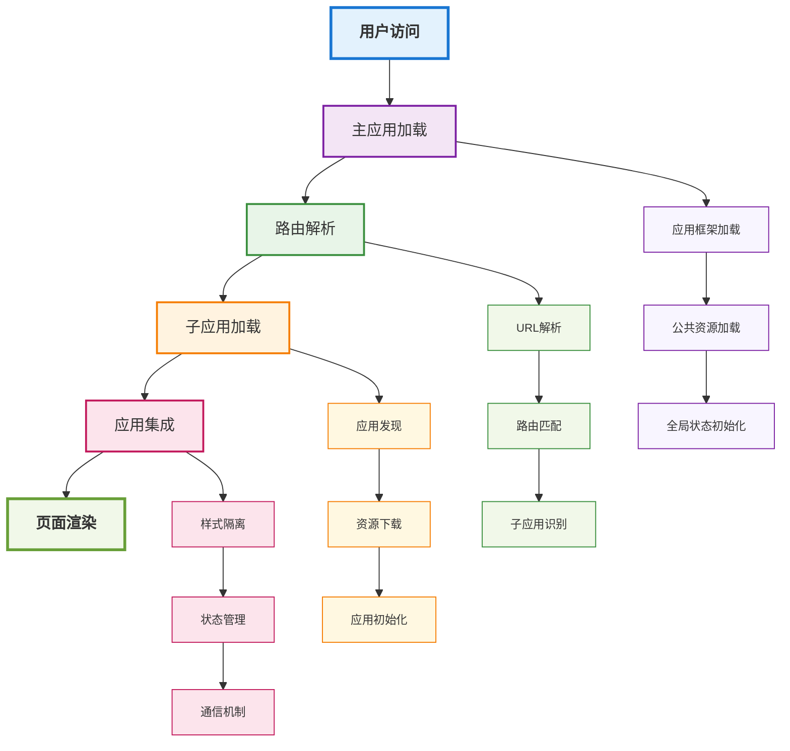

# 微前端架构实践

## 概述

微前端是一种将前端应用分解为一些更小、更简单的能够独立开发、测试、部署的应用，而在用户看来仍然是内聚的单个产品。本文将深入探讨微前端架构的设计原则、实现方案和最佳实践，帮助开发者构建可扩展的前端系统。

## 微前端架构设计



## 微前端架构模式

### 1. 架构模式对比

```
传统单体应用
├── 所有功能在一个代码库中
├── 团队协作困难
├── 技术栈锁定
└── 部署风险高

微前端架构
├── 功能模块独立
├── 团队自治
├── 技术栈灵活
└── 独立部署
```

### 2. 核心设计原则

- **独立性**：每个微前端应用可以独立开发、测试、部署
- **自治性**：团队可以自主选择技术栈和开发流程
- **隔离性**：应用间相互隔离，避免全局状态污染
- **一致性**：保持用户体验的一致性

## 技术实现方案

### 1. 路由分发模式

```typescript
// 主应用路由配置
interface MicroApp {
  name: string;
  entry: string;
  container: string;
  activeRule: string | ((location: Location) => boolean);
  props?: Record<string, any>;
}

const microApps: MicroApp[] = [
  {
    name: 'app1',
    entry: '//localhost:3001',
    container: '#micro-app-container',
    activeRule: '/app1'
  },
  {
    name: 'app2',
    entry: '//localhost:3002',
    container: '#micro-app-container',
    activeRule: '/app2'
  }
];

// 路由分发器
class MicroAppRouter {
  private apps: MicroApp[];
  private currentApp: string | null = null;

  constructor(apps: MicroApp[]) {
    this.apps = apps;
    this.init();
  }

  private init(): void {
    // 监听路由变化
    window.addEventListener('popstate', this.handleRouteChange.bind(this));
    this.handleRouteChange();
  }

  private handleRouteChange(): void {
    const currentPath = window.location.pathname;
    const targetApp = this.apps.find(app => {
      if (typeof app.activeRule === 'string') {
        return currentPath.startsWith(app.activeRule);
      }
      return app.activeRule(window.location);
    });

    if (targetApp && targetApp.name !== this.currentApp) {
      this.loadMicroApp(targetApp);
    }
  }

  private async loadMicroApp(app: MicroApp): Promise<void> {
    try {
      // 卸载当前应用
      if (this.currentApp) {
        this.unloadMicroApp(this.currentApp);
      }

      // 加载新应用
      await this.loadAppScript(app.entry);
      this.currentApp = app.name;
      
      // 触发应用加载事件
      window.dispatchEvent(new CustomEvent('microapp-loaded', {
        detail: { app: app.name }
      }));
    } catch (error) {
      console.error(`Failed to load micro app: ${app.name}`, error);
    }
  }

  private async loadAppScript(entry: string): Promise<void> {
    return new Promise((resolve, reject) => {
      const script = document.createElement('script');
      script.src = entry;
      script.onload = resolve;
      script.onerror = reject;
      document.head.appendChild(script);
    });
  }

  private unloadMicroApp(appName: string): void {
    // 清理应用资源
    window.dispatchEvent(new CustomEvent('microapp-unload', {
      detail: { app: appName }
    }));
  }
}
```

### 2. 应用生命周期管理

```typescript
// 微前端应用生命周期
interface MicroAppLifecycle {
  bootstrap: () => Promise<void>;
  mount: (props: Record<string, any>) => Promise<void>;
  unmount: () => Promise<void>;
  update?: (props: Record<string, any>) => Promise<void>;
}

// 应用注册器
class MicroAppRegistry {
  private apps = new Map<string, MicroAppLifecycle>();

  register(name: string, lifecycle: MicroAppLifecycle): void {
    this.apps.set(name, lifecycle);
  }

  getApp(name: string): MicroAppLifecycle | undefined {
    return this.apps.get(name);
  }

  async bootstrapApp(name: string): Promise<void> {
    const app = this.getApp(name);
    if (app) {
      await app.bootstrap();
    }
  }

  async mountApp(name: string, props: Record<string, any>): Promise<void> {
    const app = this.getApp(name);
    if (app) {
      await app.mount(props);
    }
  }

  async unmountApp(name: string): Promise<void> {
    const app = this.getApp(name);
    if (app) {
      await app.unmount();
    }
  }
}

// 全局应用注册器
window.microAppRegistry = new MicroAppRegistry();
```

## 通信机制

### 1. 事件总线

```typescript
// 全局事件总线
class EventBus {
  private events = new Map<string, Function[]>();

  on(event: string, callback: Function): void {
    if (!this.events.has(event)) {
      this.events.set(event, []);
    }
    this.events.get(event)!.push(callback);
  }

  off(event: string, callback: Function): void {
    if (this.events.has(event)) {
      const callbacks = this.events.get(event)!;
      const index = callbacks.indexOf(callback);
      if (index > -1) {
        callbacks.splice(index, 1);
      }
    }
  }

  emit(event: string, data?: any): void {
    if (this.events.has(event)) {
      this.events.get(event)!.forEach(callback => {
        try {
          callback(data);
        } catch (error) {
          console.error(`Error in event callback for ${event}:`, error);
        }
      });
    }
  }

  clear(): void {
    this.events.clear();
  }
}

// 全局事件总线实例
window.eventBus = new EventBus();

// 使用示例
window.eventBus.on('user-login', (userData) => {
  console.log('User logged in:', userData);
  // 更新用户状态
});

window.eventBus.emit('user-login', { id: 1, name: 'John' });
```

### 2. 状态共享

```typescript
// 全局状态管理器
interface GlobalState {
  user: User | null;
  theme: 'light' | 'dark';
  language: string;
}

class GlobalStateManager {
  private state: GlobalState = {
    user: null,
    theme: 'light',
    language: 'zh-CN'
  };

  private listeners = new Map<string, Function[]>();

  getState(): GlobalState {
    return { ...this.state };
  }

  setState(updates: Partial<GlobalState>): void {
    const oldState = { ...this.state };
    this.state = { ...this.state, ...updates };

    // 通知监听器
    Object.keys(updates).forEach(key => {
      if (this.listeners.has(key)) {
        this.listeners.get(key)!.forEach(listener => {
          try {
            listener(this.state[key as keyof GlobalState], oldState[key as keyof GlobalState]);
          } catch (error) {
            console.error(`Error in state listener for ${key}:`, error);
          }
        });
      }
    });
  }

  subscribe(key: keyof GlobalState, listener: Function): () => void {
    if (!this.listeners.has(key)) {
      this.listeners.set(key, []);
    }
    this.listeners.get(key)!.push(listener);

    // 返回取消订阅函数
    return () => {
      const callbacks = this.listeners.get(key)!;
      const index = callbacks.indexOf(listener);
      if (index > -1) {
        callbacks.splice(index, 1);
      }
    };
  }
}

// 全局状态管理器实例
window.globalState = new GlobalStateManager();

// 使用示例
const unsubscribe = window.globalState.subscribe('user', (newUser, oldUser) => {
  console.log('User state changed:', { newUser, oldUser });
});

// 更新状态
window.globalState.setState({ user: { id: 1, name: 'John' } });

// 取消订阅
unsubscribe();
```

## 样式隔离

### 1. CSS隔离策略

```typescript
// 样式隔离管理器
class StyleIsolationManager {
  private styleSheets = new Map<string, HTMLStyleElement>();
  private scopedStyles = new Map<string, string>();

  // 动态作用域CSS
  scopeStyles(css: string, appName: string): string {
    const scope = `[data-micro-app="${appName}"]`;
    return css.replace(/([^{}]+){/g, `${scope} $1{`);
  }

  // 添加应用样式
  addAppStyles(appName: string, styles: string): void {
    const scopedStyles = this.scopeStyles(styles, appName);
    const styleElement = document.createElement('style');
    styleElement.textContent = scopedStyles;
    styleElement.setAttribute('data-app', appName);
    
    document.head.appendChild(styleElement);
    this.styleSheets.set(appName, styleElement);
    this.scopedStyles.set(appName, scopedStyles);
  }

  // 移除应用样式
  removeAppStyles(appName: string): void {
    const styleElement = this.styleSheets.get(appName);
    if (styleElement) {
      document.head.removeChild(styleElement);
      this.styleSheets.delete(appName);
      this.scopedStyles.delete(appName);
    }
  }

  // 清理所有样式
  clearAllStyles(): void {
    this.styleSheets.forEach((styleElement) => {
      document.head.removeChild(styleElement);
    });
    this.styleSheets.clear();
    this.scopedStyles.clear();
  }
}

// 全局样式隔离管理器
window.styleIsolation = new StyleIsolationManager();
```

### 2. CSS-in-JS方案

```typescript
// 样式作用域工具
const createScopedStyles = (appName: string) => {
  const scope = `[data-micro-app="${appName}"]`;
  
  return {
    css: (styles: TemplateStringsArray, ...values: any[]) => {
      const cssText = styles.reduce((result, str, i) => {
        return result + str + (values[i] || '');
      }, '');
      
      return cssText.replace(/([^{}]+){/g, `${scope} $1{`);
    },
    
    styled: {
      div: (styles: string) => {
        return styled.div`
          ${styles}
        `;
      },
      button: (styles: string) => {
        return styled.button`
          ${styles}
        `;
      }
    }
  };
};

// 使用示例
const { css, styled } = createScopedStyles('app1');

const StyledButton = styled.button`
  background-color: #007bff;
  color: white;
  padding: 8px 16px;
  border: none;
  border-radius: 4px;
  cursor: pointer;
  
  &:hover {
    background-color: #0056b3;
  }
`;
```

## 应用集成

### 1. 主应用集成

```typescript
// 主应用入口
class MainApp {
  private router: MicroAppRouter;
  private registry: MicroAppRegistry;
  private styleManager: StyleIsolationManager;

  constructor() {
    this.router = new MicroAppRouter(microApps);
    this.registry = new MicroAppRegistry();
    this.styleManager = new StyleIsolationManager();
    
    this.init();
  }

  private init(): void {
    // 初始化全局服务
    this.initGlobalServices();
    
    // 设置应用容器
    this.setupAppContainer();
    
    // 监听应用事件
    this.setupEventListeners();
  }

  private initGlobalServices(): void {
    // 设置全局事件总线
    window.eventBus = new EventBus();
    
    // 设置全局状态管理器
    window.globalState = new GlobalStateManager();
    
    // 设置样式隔离管理器
    window.styleIsolation = this.styleManager;
  }

  private setupAppContainer(): void {
    const container = document.createElement('div');
    container.id = 'micro-app-container';
    container.setAttribute('data-micro-app', 'main');
    document.body.appendChild(container);
  }

  private setupEventListeners(): void {
    // 监听应用加载事件
    window.addEventListener('microapp-loaded', (event: CustomEvent) => {
      console.log(`Micro app loaded: ${event.detail.app}`);
    });

    // 监听应用卸载事件
    window.addEventListener('microapp-unload', (event: CustomEvent) => {
      console.log(`Micro app unloaded: ${event.detail.app}`);
    });
  }
}

// 启动主应用
new MainApp();
```

### 2. 子应用集成

```typescript
// 子应用入口模板
interface MicroAppEntry {
  name: string;
  bootstrap: () => Promise<void>;
  mount: (props: Record<string, any>) => Promise<void>;
  unmount: () => Promise<void>;
}

// 子应用基类
abstract class BaseMicroApp implements MicroAppEntry {
  abstract name: string;
  protected container: HTMLElement | null = null;
  protected app: React.ReactElement | null = null;

  async bootstrap(): Promise<void> {
    console.log(`Bootstraping ${this.name}`);
    // 子应用初始化逻辑
  }

  async mount(props: Record<string, any>): Promise<void> {
    console.log(`Mounting ${this.name} with props:`, props);
    
    // 创建应用容器
    this.container = document.createElement('div');
    this.container.setAttribute('data-micro-app', this.name);
    
    // 挂载React应用
    this.mountReactApp(props);
  }

  async unmount(): Promise<void> {
    console.log(`Unmounting ${this.name}`);
    
    if (this.container) {
      // 卸载React应用
      this.unmountReactApp();
      
      // 移除容器
      if (this.container.parentNode) {
        this.container.parentNode.removeChild(this.container);
      }
      
      this.container = null;
    }
  }

  protected abstract mountReactApp(props: Record<string, any>): void;
  protected abstract unmountReactApp(): void;
}

// 具体子应用实现
class UserApp extends BaseMicroApp {
  name = 'user-app';

  protected mountReactApp(props: Record<string, any>): void {
    const root = ReactDOM.createRoot(this.container!);
    this.app = React.createElement(UserAppComponent, props);
    root.render(this.app);
  }

  protected unmountReactApp(): void {
    if (this.container) {
      const root = ReactDOM.createRoot(this.container);
      root.unmount();
    }
  }
}

// 注册子应用
if (window.microAppRegistry) {
  const userApp = new UserApp();
  window.microAppRegistry.register('user-app', userApp);
}
```

## 构建与部署

### 1. 构建配置

```typescript
// 子应用webpack配置
const webpackConfig = {
  entry: './src/index.ts',
  output: {
    filename: 'bundle.js',
    path: path.resolve(__dirname, 'dist'),
    library: 'UserApp',
    libraryTarget: 'umd',
    globalObject: 'window'
  },
  externals: {
    react: 'React',
    'react-dom': 'ReactDOM'
  },
  plugins: [
    new HtmlWebpackPlugin({
      template: './public/index.html',
      filename: 'index.html'
    })
  ]
};

// 子应用package.json
{
  "name": "user-app",
  "version": "1.0.0",
  "main": "dist/bundle.js",
  "scripts": {
    "build": "webpack --mode production",
    "dev": "webpack serve --mode development"
  },
  "dependencies": {
    "react": "^18.0.0",
    "react-dom": "^18.0.0"
  },
  "devDependencies": {
    "webpack": "^5.0.0",
    "webpack-cli": "^4.0.0"
  }
}
```

### 2. 部署策略

```yaml
# Docker部署配置
# docker-compose.yml
version: '3.8'

services:
  main-app:
    build: ./main-app
    ports:
      - "3000:3000"
    environment:
      - NODE_ENV=production
    depends_on:
      - user-app
      - product-app

  user-app:
    build: ./user-app
    ports:
      - "3001:3001"
    environment:
      - NODE_ENV=production

  product-app:
    build: ./product-app
    ports:
      - "3002:3002"
    environment:
      - NODE_ENV=production

  nginx:
    image: nginx:alpine
    ports:
      - "80:80"
      - "443:443"
    volumes:
      - ./nginx.conf:/etc/nginx/nginx.conf
      - ./ssl:/etc/nginx/ssl
    depends_on:
      - main-app
      - user-app
      - product-app
```

## 性能优化

### 1. 懒加载策略

```typescript
// 应用懒加载管理器
class LazyLoadManager {
  private loadedApps = new Set<string>();
  private loadingPromises = new Map<string, Promise<void>>();

  async loadApp(appName: string): Promise<void> {
    // 如果应用已加载，直接返回
    if (this.loadedApps.has(appName)) {
      return;
    }

    // 如果应用正在加载，等待加载完成
    if (this.loadingPromises.has(appName)) {
      return this.loadingPromises.get(appName);
    }

    // 开始加载应用
    const loadPromise = this.loadAppScript(appName);
    this.loadingPromises.set(appName, loadPromise);

    try {
      await loadPromise;
      this.loadedApps.add(appName);
    } finally {
      this.loadingPromises.delete(appName);
    }
  }

  private async loadAppScript(appName: string): Promise<void> {
    const appConfig = microApps.find(app => app.name === appName);
    if (!appConfig) {
      throw new Error(`App ${appName} not found`);
    }

    return new Promise((resolve, reject) => {
      const script = document.createElement('script');
      script.src = appConfig.entry;
      script.onload = resolve;
      script.onerror = reject;
      document.head.appendChild(script);
    });
  }

  isAppLoaded(appName: string): boolean {
    return this.loadedApps.has(appName);
  }

  isAppLoading(appName: string): boolean {
    return this.loadingPromises.has(appName);
  }
}
```

### 2. 缓存策略

```typescript
// 应用缓存管理器
class AppCacheManager {
  private cache = new Map<string, { script: string; timestamp: number }>();
  private maxAge = 5 * 60 * 1000; // 5分钟

  setCache(appName: string, script: string): void {
    this.cache.set(appName, {
      script,
      timestamp: Date.now()
    });
  }

  getCache(appName: string): string | null {
    const cached = this.cache.get(appName);
    if (!cached) return null;

    // 检查缓存是否过期
    if (Date.now() - cached.timestamp > this.maxAge) {
      this.cache.delete(appName);
      return null;
    }

    return cached.script;
  }

  clearCache(): void {
    this.cache.clear();
  }

  clearExpiredCache(): void {
    const now = Date.now();
    for (const [appName, cached] of this.cache.entries()) {
      if (now - cached.timestamp > this.maxAge) {
        this.cache.delete(appName);
      }
    }
  }
}
```

## 监控与调试

### 1. 性能监控

```typescript
// 微前端性能监控
class MicroAppMonitor {
  private metrics = new Map<string, PerformanceMetrics>();

  startMonitoring(appName: string): void {
    const observer = new PerformanceObserver((list) => {
      for (const entry of list.getEntries()) {
        this.recordMetric(appName, entry);
      }
    });

    observer.observe({ entryTypes: ['navigation', 'resource'] });
  }

  private recordMetric(appName: string, entry: PerformanceEntry): void {
    if (!this.metrics.has(appName)) {
      this.metrics.set(appName, {
        loadTime: 0,
        renderTime: 0,
        resourceCount: 0
      });
    }

    const metrics = this.metrics.get(appName)!;
    
    if (entry.entryType === 'navigation') {
      const navEntry = entry as PerformanceNavigationTiming;
      metrics.loadTime = navEntry.loadEventEnd - navEntry.loadEventStart;
      metrics.renderTime = navEntry.domContentLoadedEventEnd - navEntry.domContentLoadedEventStart;
    } else if (entry.entryType === 'resource') {
      metrics.resourceCount++;
    }
  }

  getMetrics(appName: string): PerformanceMetrics | undefined {
    return this.metrics.get(appName);
  }

  getAllMetrics(): Map<string, PerformanceMetrics> {
    return new Map(this.metrics);
  }
}

interface PerformanceMetrics {
  loadTime: number;
  renderTime: number;
  resourceCount: number;
}
```

### 2. 错误监控

```typescript
// 微前端错误监控
class MicroAppErrorMonitor {
  private errors = new Map<string, Error[]>();

  startMonitoring(): void {
    // 监听全局错误
    window.addEventListener('error', this.handleError.bind(this));
    
    // 监听Promise错误
    window.addEventListener('unhandledrejection', this.handlePromiseError.bind(this));
  }

  private handleError(event: ErrorEvent): void {
    const appName = this.getAppNameFromError(event);
    this.recordError(appName, event.error);
  }

  private handlePromiseError(event: PromiseRejectionEvent): void {
    const appName = this.getAppNameFromError(event);
    this.recordError(appName, event.reason);
  }

  private getAppNameFromError(event: ErrorEvent | PromiseRejectionEvent): string {
    // 从错误堆栈中识别应用名称
    const stack = event.error?.stack || '';
    for (const app of microApps) {
      if (stack.includes(app.name)) {
        return app.name;
      }
    }
    return 'unknown';
  }

  private recordError(appName: string, error: Error): void {
    if (!this.errors.has(appName)) {
      this.errors.set(appName, []);
    }
    this.errors.get(appName)!.push(error);

    // 发送错误到监控服务
    this.sendErrorToMonitoring(appName, error);
  }

  private sendErrorToMonitoring(appName: string, error: Error): void {
    // 实现错误上报逻辑
    console.error(`Error in ${appName}:`, error);
  }

  getErrors(appName: string): Error[] {
    return this.errors.get(appName) || [];
  }

  clearErrors(appName?: string): void {
    if (appName) {
      this.errors.delete(appName);
    } else {
      this.errors.clear();
    }
  }
}
```

## 最佳实践

### 1. 架构设计原则

- **单一职责**：每个微前端应用专注于特定业务领域
- **松耦合**：应用间通过标准接口通信，避免直接依赖
- **高内聚**：相关功能组织在同一个应用中
- **渐进式**：可以逐步将单体应用拆分为微前端

### 2. 开发规范

```typescript
// 微前端开发规范
const MicroFrontendGuidelines = {
  // 命名规范
  naming: {
    appPrefix: 'micro-app',
    eventPrefix: 'micro-app',
    cssScope: 'data-micro-app'
  },

  // 通信规范
  communication: {
    events: {
      login: 'user-login',
      logout: 'user-logout',
      themeChange: 'theme-change'
    },
    state: {
      user: 'user',
      theme: 'theme',
      language: 'language'
    }
  },

  // 样式规范
  styling: {
    scopeAttribute: 'data-micro-app',
    globalClassPrefix: 'global-',
    appClassPrefix: 'app-'
  },

  // 错误处理规范
  errorHandling: {
    maxRetries: 3,
    retryDelay: 1000,
    errorReporting: true
  }
};
```

## 总结

微前端架构为大型前端应用提供了灵活的解决方案：

1. **架构设计**：建立清晰的微前端架构模式
2. **技术实现**：选择合适的集成和通信方案
3. **性能优化**：实现懒加载和缓存策略
4. **监控调试**：建立完善的监控和错误处理体系

掌握微前端架构有助于：
- 提升团队开发效率
- 实现技术栈多样化
- 降低系统耦合度
- 支持独立部署和扩展

在实际项目中，应该根据团队规模、技术栈和业务需求选择合适的微前端方案，注重应用间的协调和用户体验的一致性。 