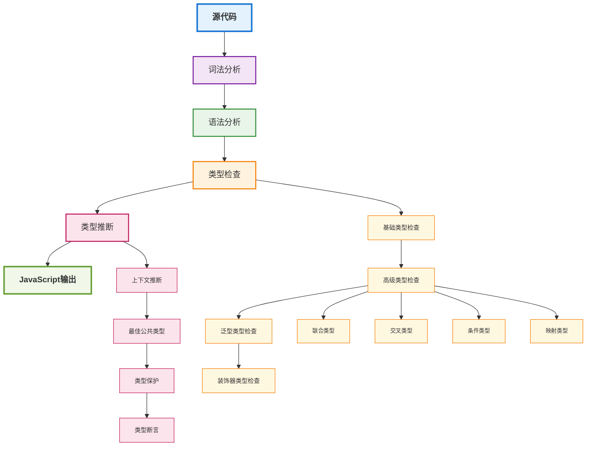

# TypeScript高级应用

## 概述

TypeScript作为JavaScript的超集，在企业级前端开发中发挥着越来越重要的作用。它不仅提供了静态类型检查，还通过高级类型系统、装饰器、泛型等特性，为大型项目的开发和维护提供了强有力的支持。

## TypeScript类型系统架构



## 高级类型系统

### 1. 条件类型 (Conditional Types)

条件类型允许根据输入类型动态选择输出类型：

```typescript
// 基础条件类型
type NonNullable<T> = T extends null | undefined ? never : T;

// 条件类型与联合类型结合
type Extract<T, U> = T extends U ? T : never;
type Exclude<T, U> = T extends U ? never : T;

// 实际应用示例
type UserRole = 'admin' | 'user' | 'guest';
type AdminOnly = Extract<UserRole, 'admin'>; // 'admin'
type NonAdmin = Exclude<UserRole, 'admin'>;  // 'user' | 'guest'

// 条件类型与函数类型
type ReturnType<T> = T extends (...args: any[]) => infer R ? R : any;
type Parameters<T> = T extends (...args: infer P) => any ? P : never;

// 条件类型与对象类型
type Pick<T, K extends keyof T> = {
  [P in K]: T[P];
};

type Omit<T, K extends keyof T> = Pick<T, Exclude<keyof T, K>>;
```

### 2. 映射类型 (Mapped Types)

映射类型允许从现有类型创建新类型：

```typescript
// 基础映射类型
type Readonly<T> = {
  readonly [P in keyof T]: T[P];
};

type Partial<T> = {
  [P in keyof T]?: T[P];
};

type Required<T> = {
  [P in keyof T]-?: T[P];
};

// 高级映射类型
type DeepReadonly<T> = {
  readonly [P in keyof T]: T[P] extends object 
    ? DeepReadonly<T[P]> 
    : T[P];
};

type DeepPartial<T> = {
  [P in keyof T]?: T[P] extends object 
    ? DeepPartial<T[P]> 
    : T[P];
};

// 条件映射类型
type ConditionalPick<T, U> = {
  [K in keyof T as T[K] extends U ? K : never]: T[K];
};

// 实际应用
interface User {
  id: number;
  name: string;
  profile: {
    email: string;
    avatar: string;
  };
}

type ReadonlyUser = DeepReadonly<User>;
type PartialUser = DeepPartial<User>;
type StringProps = ConditionalPick<User, string>; // { name: string }
```

### 3. 模板字面量类型 (Template Literal Types)

模板字面量类型允许基于字符串字面量创建类型：

```typescript
// 基础模板字面量类型
type EventName = 'click' | 'hover' | 'focus';
type EventHandler = `on${Capitalize<EventName>}`; // 'onClick' | 'onHover' | 'onFocus'

// 高级模板字面量类型
type PathParams<T extends string> = T extends `${infer Start}:${infer Param}/${infer Rest}`
  ? Param | PathParams<`${Start}/${Rest}`>
  : T extends `${infer Start}:${infer Param}`
  ? Param
  : never;

// 实际应用
type ApiPath = '/users/:id/posts/:postId';
type PathVariables = PathParams<ApiPath>; // 'id' | 'postId'

// 路由类型生成
type RouteParams<T extends string> = {
  [K in PathParams<T>]: string | number;
};

type UserPostRoute = RouteParams<'/users/:id/posts/:postId'>;
// { id: string | number; postId: string | number }
```

## 泛型高级用法

### 1. 泛型约束 (Generic Constraints)

泛型约束允许限制泛型类型的范围：

```typescript
// 基础约束
interface HasLength {
  length: number;
}

function logLength<T extends HasLength>(arg: T): T {
  console.log(`Length: ${arg.length}`);
  return arg;
}

// 多重约束
interface HasId {
  id: string | number;
}

interface HasName {
  name: string;
}

function processEntity<T extends HasId & HasName>(entity: T): T {
  console.log(`Processing ${entity.name} with ID ${entity.id}`);
  return entity;
}

// 约束与条件类型结合
type ExtractProperty<T, K extends keyof T> = T[K];
type ExtractId<T extends HasId> = ExtractProperty<T, 'id'>;

// 实际应用
interface User extends HasId, HasName {
  email: string;
  age: number;
}

const user: User = { id: 1, name: 'John', email: 'john@example.com', age: 30 };
const userId = processEntity(user); // 类型安全
```

### 2. 泛型默认值 (Generic Defaults)

泛型默认值允许在不指定类型参数时使用默认类型：

```typescript
// 基础默认值
interface ApiResponse<T = any> {
  data: T;
  status: number;
  message: string;
}

// 复杂默认值
interface PaginationParams<T = string> {
  page: number;
  limit: number;
  sortBy?: T;
  sortOrder?: 'asc' | 'desc';
}

// 实际应用
interface User {
  id: number;
  name: string;
  email: string;
}

type UserListResponse = ApiResponse<User[]>;
type PaginatedUsers = PaginationParams<keyof User>;

// 使用默认值
const response: ApiResponse = { data: null, status: 200, message: 'OK' };
const params: PaginationParams = { page: 1, limit: 10 };
```

### 3. 泛型工具类型

创建可重用的泛型工具类型：

```typescript
// 类型转换工具
type ToPromise<T> = T extends Promise<infer U> ? T : Promise<T>;
type ToArray<T> = T extends Array<infer U> ? T : T[];

// 函数类型工具
type AsyncFunction<T extends any[], R> = (...args: T) => Promise<R>;
type SyncFunction<T extends any[], R> = (...args: T) => R;

// 对象类型工具
type Flatten<T> = {
  [K in keyof T]: T[K] extends object ? Flatten<T[K]> : T[K];
};

// 实际应用
type AsyncUserFetcher = AsyncFunction<[number], User>;
type SyncUserValidator = SyncFunction<[User], boolean>;

// 类型转换示例
type UserPromise = ToPromise<User>; // Promise<User>
type UserArray = ToArray<User>;     // User[]
```

## 装饰器与元数据

### 1. 类装饰器

类装饰器允许在类定义时修改类的行为：

```typescript
// 基础类装饰器
function Logger<T extends { new (...args: any[]): {} }>(constructor: T) {
  return class extends constructor {
    constructor(...args: any[]) {
      super(...args);
      console.log(`Creating instance of ${constructor.name}`);
    }
  };
}

// 工厂装饰器
function Singleton<T extends { new (...args: any[]): {} }>(constructor: T) {
  let instance: T | null = null;
  
  return class extends constructor {
    constructor(...args: any[]) {
      if (instance) {
        return instance;
      }
      super(...args);
      instance = this;
    }
  };
}

// 实际应用
@Logger
@Singleton
class DatabaseConnection {
  constructor(private url: string) {
    console.log(`Connecting to ${url}`);
  }
  
  query(sql: string): Promise<any> {
    return Promise.resolve({ result: 'data' });
  }
}

const db1 = new DatabaseConnection('mysql://localhost:3306/db');
const db2 = new DatabaseConnection('mysql://localhost:3306/db');
console.log(db1 === db2); // true
```

### 2. 方法装饰器

方法装饰器允许修改类方法的行为：

```typescript
// 缓存装饰器
function Cache<T extends object, K extends keyof T>(
  target: T,
  propertyKey: K,
  descriptor: PropertyDescriptor
) {
  const originalMethod = descriptor.value;
  const cache = new Map();
  
  descriptor.value = function(...args: any[]) {
    const key = JSON.stringify(args);
    
    if (cache.has(key)) {
      console.log('Returning cached result');
      return cache.get(key);
    }
    
    const result = originalMethod.apply(this, args);
    cache.set(key, result);
    return result;
  };
  
  return descriptor;
}

// 重试装饰器
function Retry(attempts: number = 3, delay: number = 1000) {
  return function<T extends object, K extends keyof T>(
    target: T,
    propertyKey: K,
    descriptor: PropertyDescriptor
  ) {
    const originalMethod = descriptor.value;
    
    descriptor.value = async function(...args: any[]) {
      for (let i = 0; i < attempts; i++) {
        try {
          return await originalMethod.apply(this, args);
        } catch (error) {
          if (i === attempts - 1) throw error;
          await new Promise(resolve => setTimeout(resolve, delay));
        }
      }
    };
    
    return descriptor;
  };
}

// 实际应用
class UserService {
  @Cache
  async getUser(id: number): Promise<User> {
    // 模拟API调用
    return { id, name: `User ${id}`, email: `user${id}@example.com` };
  }
  
  @Retry(3, 1000)
  async createUser(user: Omit<User, 'id'>): Promise<User> {
    // 模拟可能失败的API调用
    if (Math.random() < 0.5) {
      throw new Error('Network error');
    }
    return { id: Math.random(), ...user };
  }
}
```

### 3. 属性装饰器

属性装饰器允许修改类属性的行为：

```typescript
// 验证装饰器
function Validate(validator: (value: any) => boolean) {
  return function(target: any, propertyKey: string) {
    let value: any;
    
    Object.defineProperty(target, propertyKey, {
      get() {
        return value;
      },
      set(newValue: any) {
        if (!validator(newValue)) {
          throw new Error(`Invalid value for ${propertyKey}: ${newValue}`);
        }
        value = newValue;
      }
    });
  };
}

// 实际应用
class User {
  @Validate((email: string) => email.includes('@'))
  email: string = '';
  
  @Validate((age: number) => age >= 0 && age <= 150)
  age: number = 0;
}

const user = new User();
user.email = 'valid@email.com'; // OK
user.age = 25; // OK

try {
  user.email = 'invalid-email'; // Error
} catch (error) {
  console.error(error.message);
}
```

## 高级类型操作

### 1. 类型推断 (Type Inference)

利用TypeScript的类型推断能力：

```typescript
// 函数返回类型推断
function createUser(name: string, email: string) {
  return {
    id: Math.random(),
    name,
    email,
    createdAt: new Date()
  };
}

type User = ReturnType<typeof createUser>;

// 数组类型推断
const users = [
  { id: 1, name: 'John', role: 'admin' },
  { id: 2, name: 'Jane', role: 'user' }
] as const;

type UserRole = typeof users[number]['role']; // 'admin' | 'user'

// 对象类型推断
const config = {
  api: {
    baseUrl: 'https://api.example.com',
    timeout: 5000
  },
  features: {
    darkMode: true,
    notifications: false
  }
} as const;

type ApiConfig = typeof config.api;
type FeatureConfig = typeof config.features;
```

### 2. 类型保护 (Type Guards)

类型保护允许在运行时检查类型：

```typescript
// 基础类型保护
function isString(value: any): value is string {
  return typeof value === 'string';
}

function isNumber(value: any): value is number {
  return typeof value === 'number';
}

// 联合类型保护
function isUser(value: any): value is User {
  return value && typeof value.id === 'number' && typeof value.name === 'string';
}

// 实际应用
function processValue(value: string | number | User) {
  if (isString(value)) {
    console.log(`String: ${value.toUpperCase()}`);
  } else if (isNumber(value)) {
    console.log(`Number: ${value.toFixed(2)}`);
  } else if (isUser(value)) {
    console.log(`User: ${value.name} (ID: ${value.id})`);
  }
}

// 类型保护与泛型
function isArrayOf<T>(value: any, typeGuard: (item: any) => item is T): value is T[] {
  return Array.isArray(value) && value.every(typeGuard);
}

const userArray = [{ id: 1, name: 'John' }, { id: 2, name: 'Jane' }];
if (isArrayOf(userArray, isUser)) {
  userArray.forEach(user => console.log(user.name));
}
```

### 3. 类型断言 (Type Assertions)

类型断言允许手动指定类型：

```typescript
// 基础类型断言
const value: any = 'hello world';
const length: number = (value as string).length;

// 双重断言
const element = document.getElementById('app') as HTMLElement;
const canvas = element as HTMLCanvasElement;

// 类型断言函数
function assertIsString(value: any): asserts value is string {
  if (typeof value !== 'string') {
    throw new Error('Value is not a string');
  }
}

function assertIsUser(value: any): asserts value is User {
  if (!isUser(value)) {
    throw new Error('Value is not a User');
  }
}

// 实际应用
function processUserData(data: any) {
  assertIsUser(data);
  
  // 这里TypeScript知道data是User类型
  console.log(`Processing user: ${data.name}`);
  return data.id;
}
```

## 实际应用场景

### 1. API类型安全

```typescript
// API响应类型
interface ApiResponse<T> {
  data: T;
  status: 'success' | 'error';
  message: string;
  timestamp: string;
}

// API客户端
class ApiClient {
  private baseUrl: string;
  
  constructor(baseUrl: string) {
    this.baseUrl = baseUrl;
  }
  
  async get<T>(endpoint: string): Promise<ApiResponse<T>> {
    const response = await fetch(`${this.baseUrl}${endpoint}`);
    return response.json();
  }
  
  async post<T, R>(endpoint: string, data: T): Promise<ApiResponse<R>> {
    const response = await fetch(`${this.baseUrl}${endpoint}`, {
      method: 'POST',
      headers: { 'Content-Type': 'application/json' },
      body: JSON.stringify(data)
    });
    return response.json();
  }
}

// 使用示例
const api = new ApiClient('https://api.example.com');

interface CreateUserRequest {
  name: string;
  email: string;
}

interface CreateUserResponse {
  id: number;
  name: string;
  email: string;
}

const createUser = async (userData: CreateUserRequest) => {
  const response = await api.post<CreateUserRequest, CreateUserResponse>('/users', userData);
  return response.data;
};
```

### 2. 状态管理类型

```typescript
// 状态类型
interface AppState {
  user: User | null;
  posts: Post[];
  loading: boolean;
  error: string | null;
}

// Action类型
type AppAction = 
  | { type: 'SET_USER'; payload: User }
  | { type: 'SET_POSTS'; payload: Post[] }
  | { type: 'SET_LOADING'; payload: boolean }
  | { type: 'SET_ERROR'; payload: string | null };

// Reducer类型
type AppReducer = (state: AppState, action: AppAction) => AppState;

// 实际实现
const appReducer: AppReducer = (state, action) => {
  switch (action.type) {
    case 'SET_USER':
      return { ...state, user: action.payload };
    case 'SET_POSTS':
      return { ...state, posts: action.payload };
    case 'SET_LOADING':
      return { ...state, loading: action.payload };
    case 'SET_ERROR':
      return { ...state, error: action.payload };
    default:
      return state;
  }
};
```

### 3. 组件库类型

```typescript
// 组件Props类型
interface ButtonProps {
  variant?: 'primary' | 'secondary' | 'danger';
  size?: 'small' | 'medium' | 'large';
  disabled?: boolean;
  onClick?: (event: React.MouseEvent<HTMLButtonElement>) => void;
  children: React.ReactNode;
}

// 高阶组件类型
type WithLoading<T extends object> = T & {
  loading?: boolean;
  error?: string | null;
};

type WithPagination<T extends object> = T & {
  page: number;
  limit: number;
  total: number;
  onPageChange: (page: number) => void;
};

// 实际应用
const withLoading = <T extends object>(
  Component: React.ComponentType<T>
): React.ComponentType<WithLoading<T>> => {
  return (props: WithLoading<T>) => {
    const { loading, error, ...rest } = props;
    
    if (loading) return <div>Loading...</div>;
    if (error) return <div>Error: {error}</div>;
    
    return <Component {...(rest as T)} />;
  };
};

const UserList = withLoading<UserListProps>(BaseUserList);
```

## 最佳实践

### 1. 类型定义原则

- **明确性**：类型定义应该清晰明确
- **可重用性**：创建可重用的类型定义
- **一致性**：保持类型命名和结构的一致性
- **文档化**：为复杂类型添加注释说明

### 2. 性能考虑

- **避免过度泛型**：不要为简单场景使用复杂泛型
- **合理使用any**：在必要时才使用any类型
- **类型缓存**：缓存复杂的类型计算结果

### 3. 团队协作

- **类型规范**：建立团队的类型定义规范
- **代码审查**：在代码审查中关注类型定义
- **文档维护**：及时更新类型定义文档

## 总结

TypeScript的高级特性为企业级前端开发提供了强大的类型安全保障：

1. **高级类型系统**：条件类型、映射类型、模板字面量类型
2. **泛型高级用法**：约束、默认值、工具类型
3. **装饰器与元数据**：类、方法、属性装饰器
4. **高级类型操作**：类型推断、类型保护、类型断言

掌握这些特性能够：
- 创建更加类型安全的代码
- 提高代码的可维护性和可读性
- 减少运行时错误
- 提升开发效率

在实际项目中，应该根据项目规模和团队能力选择合适的TypeScript特性，避免过度使用导致代码复杂度增加。 