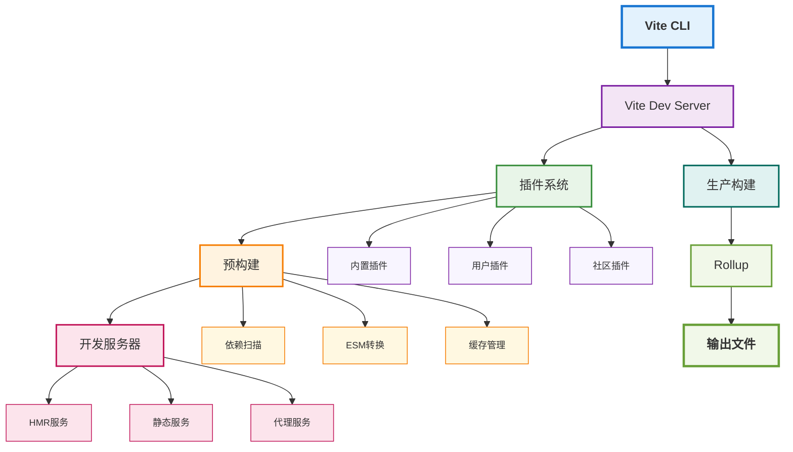
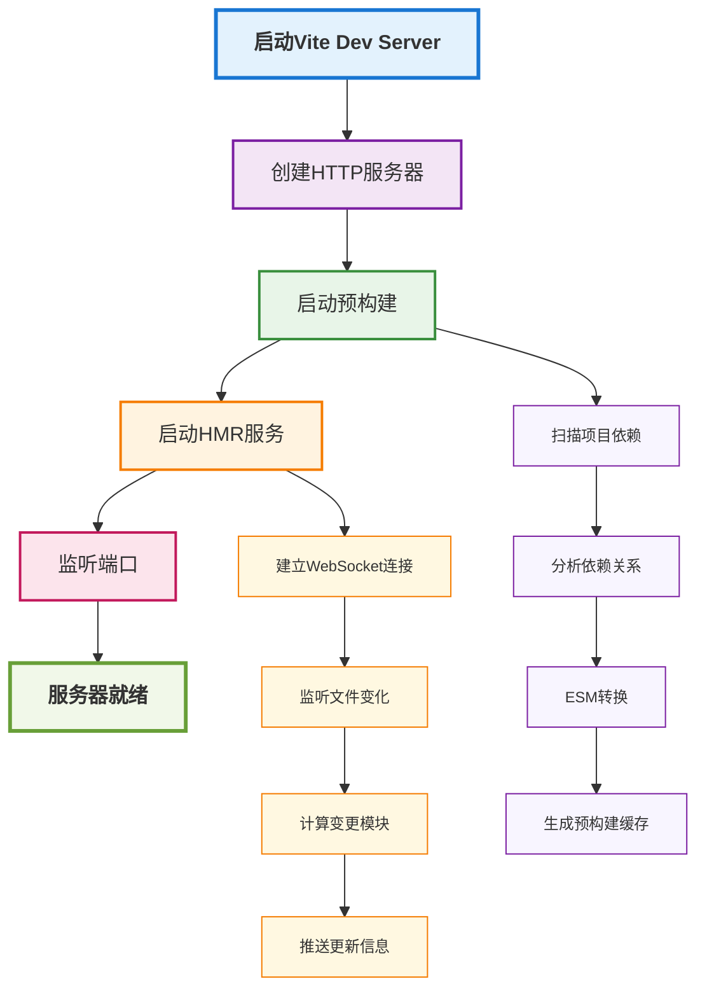

# Vite构建原理与源码深度剖析

## 概述

Vite是一个现代化的前端构建工具，由Vue.js作者尤雨溪开发。它以极快的开发服务器启动和热更新著称，在生产构建时使用Rollup进行打包。本文将深入分析Vite的核心原理和源码实现。

## Vite架构设计

### 整体架构



### 核心模块
- **CLI模块**：命令行接口和参数解析
- **Dev Server**：开发服务器和HMR
- **预构建**：依赖预构建和缓存
- **插件系统**：统一的插件接口
- **构建模块**：生产环境构建

## 开发服务器原理

### 1. 服务器启动流程



```typescript
// 简化的服务器启动流程
class ViteDevServer {
  async listen(port: number): Promise<void> {
    // 1. 创建HTTP服务器
    this.httpServer = createServer(this.middleware);
    
    // 2. 启动预构建
    await this.runPrebuild();
    
    // 3. 启动HMR
    this.setupHMR();
    
    // 4. 监听端口
    this.httpServer.listen(port);
  }
  
  private async runPrebuild(): Promise<void> {
    // 扫描依赖
    const deps = await this.scanDependencies();
    
    // 预构建依赖
    await this.prebuildDependencies(deps);
  }
}
```

### 2. 中间件系统

Vite使用Connect中间件来处理请求：

```typescript
// 中间件链示例
app.use(corsMiddleware);
app.use(proxyMiddleware);
app.use(transformMiddleware);
app.use(serveStaticMiddleware);
app.use(historyApiFallbackMiddleware);
```

#### 核心中间件

**转换中间件 (Transform Middleware)**
```typescript
// 简化的转换中间件
const transformMiddleware = async (req: IncomingMessage, res: ServerResponse, next: NextFunction) => {
  const url = req.url;
  
  if (isJSRequest(url)) {
    try {
      // 1. 解析模块
      const module = await resolveModule(url);
      
      // 2. 转换代码
      const transformed = await transformCode(module);
      
      // 3. 返回结果
      res.setHeader('Content-Type', 'application/javascript');
      res.end(transformed);
    } catch (error) {
      next(error);
    }
  } else {
    next();
  }
};
```

**HMR中间件 (HMR Middleware)**
```typescript
// HMR中间件实现
const hmrMiddleware = (req: IncomingMessage, res: ServerResponse, next: NextFunction) => {
  if (req.url === '/__vite_hmr') {
    res.writeHead(200, {
      'Content-Type': 'text/event-stream',
      'Cache-Control': 'no-cache',
      'Connection': 'keep-alive'
    });
    
    // 建立SSE连接
    const client = { res, id: generateId() };
    this.hmrClients.add(client);
    
    req.on('close', () => {
      this.hmrClients.delete(client);
    });
  } else {
    next();
  }
};
```

## 预构建机制

### 1. 依赖扫描

```typescript
// 依赖扫描器
class DependencyScanner {
  async scanDependencies(root: string): Promise<DependencyInfo[]> {
    const deps: DependencyInfo[] = [];
    
    // 扫描package.json
    const pkg = await this.readPackageJson(root);
    
    // 扫描入口文件
    const entryFiles = await this.findEntryFiles(root);
    
    // 解析依赖关系
    for (const file of entryFiles) {
      const imports = await this.parseImports(file);
      deps.push(...imports);
    }
    
    return this.deduplicateDeps(deps);
  }
  
  private async parseImports(file: string): Promise<string[]> {
    const content = await readFile(file, 'utf-8');
    const ast = parse(content);
    
    // 提取import语句
    return this.extractImports(ast);
  }
}
```

### 2. 预构建流程

```typescript
// 预构建管理器
class PrebuildManager {
  async prebuildDependencies(deps: DependencyInfo[]): Promise<void> {
    for (const dep of deps) {
      if (this.shouldPrebuild(dep)) {
        await this.prebuildDependency(dep);
      }
    }
  }
  
  private async prebuildDependency(dep: DependencyInfo): Promise<void> {
    const cacheKey = this.generateCacheKey(dep);
    
    // 检查缓存
    if (await this.isCacheValid(cacheKey)) {
      return;
    }
    
    // 执行预构建
    const result = await this.esbuild.build({
      entryPoints: [dep.entry],
      bundle: true,
      format: 'esm',
      outdir: this.prebuildDir,
      metafile: true
    });
    
    // 保存缓存
    await this.saveCache(cacheKey, result);
  }
}
```

### 3. 缓存策略

```typescript
// 缓存管理器
class CacheManager {
  private cacheDir: string;
  private cacheMap = new Map<string, CacheEntry>();
  
  async get(key: string): Promise<CacheEntry | null> {
    const entry = this.cacheMap.get(key);
    
    if (entry && await this.isValid(entry)) {
      return entry;
    }
    
    return null;
  }
  
  async set(key: string, entry: CacheEntry): Promise<void> {
    this.cacheMap.set(key, entry);
    await this.persistCache(key, entry);
  }
  
  private async isValid(entry: CacheEntry): Promise<boolean> {
    // 检查文件是否存在
    if (!existsSync(entry.filePath)) {
      return false;
    }
    
    // 检查修改时间
    const stats = statSync(entry.filePath);
    return stats.mtime.getTime() === entry.mtime;
  }
}
```

## 模块解析机制

### 1. 模块解析器

```typescript
// 模块解析器
class ModuleResolver {
  async resolveModule(specifier: string, importer: string): Promise<ResolvedModule> {
    // 1. 检查是否是相对路径
    if (specifier.startsWith('./') || specifier.startsWith('../')) {
      return this.resolveRelativeModule(specifier, importer);
    }
    
    // 2. 检查是否是预构建的依赖
    if (this.isPrebuiltDependency(specifier)) {
      return this.resolvePrebuiltModule(specifier);
    }
    
    // 3. 检查是否是node_modules中的包
    if (this.isNodeModule(specifier)) {
      return this.resolveNodeModule(specifier);
    }
    
    // 4. 检查是否是虚拟模块
    if (this.isVirtualModule(specifier)) {
      return this.resolveVirtualModule(specifier);
    }
    
    throw new Error(`Cannot resolve module: ${specifier}`);
  }
}
```

### 2. 虚拟模块支持

```typescript
// 虚拟模块处理器
class VirtualModuleHandler {
  private virtualModules = new Map<string, VirtualModule>();
  
  register(id: string, handler: VirtualModuleHandler): void {
    this.virtualModules.set(id, handler);
  }
  
  async resolve(id: string): Promise<VirtualModule | null> {
    const handler = this.virtualModules.get(id);
    
    if (handler) {
      return await handler.resolve(id);
    }
    
    return null;
  }
}

// 虚拟模块示例：CSS模块
const cssModulesHandler: VirtualModuleHandler = {
  async resolve(id: string): Promise<VirtualModule> {
    const cssContent = await this.loadCSS(id);
    const jsCode = this.generateCSSModulesCode(cssContent);
    
    return {
      code: jsCode,
      map: null
    };
  }
};
```

## 热更新 (HMR) 实现

### 1. HMR客户端

```typescript
// HMR客户端
class HMRClient {
  private socket: EventSource;
  private callbacks = new Map<string, Function[]>();
  
  constructor(serverUrl: string) {
    this.socket = new EventSource(`${serverUrl}/__vite_hmr`);
    this.setupEventListeners();
  }
  
  private setupEventListeners(): void {
    this.socket.addEventListener('message', (event) => {
      const data = JSON.parse(event.data);
      this.handleUpdate(data);
    });
  }
  
  private handleUpdate(data: HMRUpdate): void {
    switch (data.type) {
      case 'update':
        this.applyUpdate(data);
        break;
      case 'full-reload':
        this.fullReload();
        break;
    }
  }
  
  private applyUpdate(update: HMRUpdate): void {
    // 应用模块更新
    const { path, timestamp, updates } = update;
    
    for (const update of updates) {
      if (update.type === 'js-update') {
        this.applyJSUpdate(update);
      } else if (update.type === 'css-update') {
        this.applyCSSUpdate(update);
      }
    }
  }
}
```

### 2. HMR服务器

```types_code
// HMR服务器
class HMRServer {
  private clients = new Set<HMRClient>();
  
  notifyUpdate(update: HMRUpdate): void {
    for (const client of this.clients) {
      client.send(update);
    }
  }
  
  private send(client: HMRClient, data: any): void {
    const message = `data: ${JSON.stringify(data)}\n\n`;
    client.res.write(message);
  }
}
```

## 插件系统

### 1. 插件接口

```typescript
// 插件接口定义
interface Plugin {
  name: string;
  enforce?: 'pre' | 'post';
  apply?: 'serve' | 'build' | 'serve' | 'build';
  
  // 配置钩子
  config?: (config: UserConfig, env: ConfigEnv) => UserConfig | Promise<UserConfig>;
  configResolved?: (config: ResolvedConfig) => void | Promise<void>;
  
  // 开发服务器钩子
  configureServer?: (server: ViteDevServer) => void | Promise<void>;
  handleHotUpdate?: (ctx: HMRContext) => HMRUpdate[] | Promise<HMRUpdate[]>;
  
  // 构建钩子
  buildStart?: () => void | Promise<void>;
  transform?: (code: string, id: string) => TransformResult | Promise<TransformResult>;
  buildEnd?: () => void | Promise<void>;
}
```

### 2. 插件执行流程

```typescript
// 插件管理器
class PluginManager {
  private plugins: Plugin[] = [];
  
  async executeHook<T extends keyof Plugin>(
    hook: T,
    ...args: Parameters<NonNullable<Plugin[T]>>
  ): Promise<any[]> {
    const results: any[] = [];
    
    for (const plugin of this.plugins) {
      const handler = plugin[hook];
      
      if (typeof handler === 'function') {
        try {
          const result = await handler.apply(plugin, args);
          if (result !== undefined) {
            results.push(result);
          }
        } catch (error) {
          this.handlePluginError(plugin, hook, error);
        }
      }
    }
    
    return results;
  }
}
```

## 生产构建

### 1. 构建流程

```typescript
// 构建管理器
class BuildManager {
  async build(options: BuildOptions): Promise<BuildResult> {
    // 1. 解析配置
    const config = await this.resolveConfig(options);
    
    // 2. 执行构建前钩子
    await this.pluginManager.executeHook('buildStart');
    
    // 3. 创建Rollup构建
    const bundle = await rollup.rollup({
      input: config.build.rollupOptions?.input || 'index.html',
      plugins: this.createRollupPlugins(config),
      ...config.build.rollupOptions
    });
    
    // 4. 生成输出
    const result = await bundle.write({
      dir: config.build.outDir,
      format: 'es',
      ...config.build.rollupOptions?.output
    });
    
    // 5. 执行构建后钩子
    await this.pluginManager.executeHook('buildEnd');
    
    return result;
  }
}
```

### 2. Rollup插件适配

```typescript
// Vite插件到Rollup插件的适配器
class ViteToRollupAdapter {
  adaptPlugin(vitePlugin: Plugin): RollupPlugin {
    return {
      name: vitePlugin.name,
      
      // 配置钩子
      options(options: RollupOptions) {
        if (vitePlugin.config) {
          return this.adaptConfig(options);
        }
        return options;
      },
      
      // 转换钩子
      transform(code: string, id: string) {
        if (vitePlugin.transform) {
          return vitePlugin.transform(code, id);
        }
        return null;
      }
    };
  }
}
```

## 性能优化策略

### 1. 依赖预构建优化

- **并行预构建**：多个依赖同时预构建
- **增量预构建**：只重新构建变更的依赖
- **智能缓存**：基于文件内容的缓存策略

### 2. 开发服务器优化

- **懒加载**：按需加载模块
- **预加载**：预测用户行为，提前加载
- **压缩传输**：gzip/brotli压缩

### 3. 构建优化

- **并行构建**：多进程并行处理
- **缓存优化**：持久化缓存和增量构建
- **代码分割**：智能的代码分割策略

## 实际应用场景

### 1. 大型项目开发
- 快速启动开发服务器
- 高效的HMR体验
- 智能的依赖预构建

### 2. 微前端架构
- 模块联邦支持
- 独立开发和构建
- 运行时集成

### 3. 组件库开发
- 快速预览和调试
- 多格式输出支持
- 按需加载优化

## 总结

Vite通过以下核心机制实现了极快的开发体验：

1. **ESM原生支持**：开发环境无需打包，直接使用ES模块
2. **智能预构建**：预构建依赖，避免重复处理
3. **高效HMR**：基于ESM的精确热更新
4. **插件生态**：丰富的插件支持各种需求
5. **生产优化**：使用Rollup进行生产环境构建

理解Vite的原理有助于：
- 更好地配置和优化Vite项目
- 开发自定义插件
- 解决构建过程中的问题
- 选择合适的技术方案 