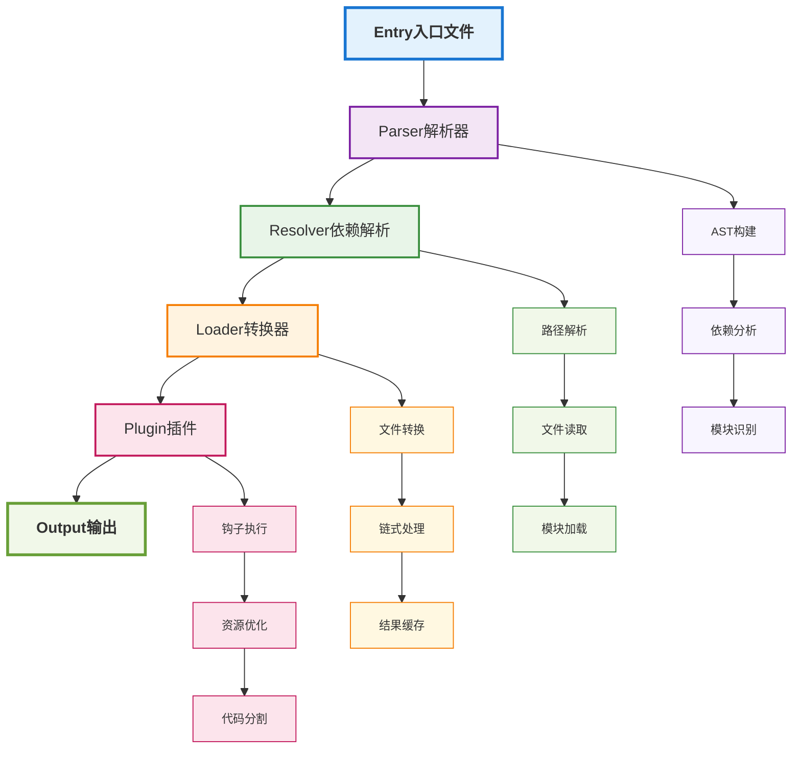

# Webpack原理深度剖析

## 概述

Webpack是现代前端开发中最流行的模块打包工具之一。它通过模块化的方式处理各种资源，将它们打包成适合生产环境的静态资源。本文将深入分析Webpack的核心原理、架构设计和优化策略。

## Webpack核心概念

### 1. 模块化系统

Webpack的核心思想是一切都是模块，包括JavaScript、CSS、图片、字体等资源。

```typescript
// 模块定义示例
interface Module {
  id: string;           // 模块ID
  dependencies: string[]; // 依赖列表
  source: string;       // 源码内容
  ast?: ASTNode;        // 抽象语法树
  chunks: string[];     // 所属chunk
}
```

### 2. 依赖图 (Dependency Graph)

Webpack通过分析模块间的依赖关系构建依赖图：

```typescript
// 依赖图构建过程
class DependencyGraph {
  private modules = new Map<string, Module>();
  private dependencies = new Map<string, string[]>();
  
  addModule(module: Module): void {
    this.modules.set(module.id, module);
    this.dependencies.set(module.id, module.dependencies);
  }
  
  buildGraph(): void {
    // 构建依赖关系图
    for (const [id, deps] of this.dependencies) {
      for (const dep of deps) {
        this.addDependency(id, dep);
      }
    }
  }
  
  private addDependency(from: string, to: string): void {
    // 添加依赖关系
    if (!this.dependencies.has(from)) {
      this.dependencies.set(from, []);
    }
    this.dependencies.get(from)!.push(to);
  }
}
```

## Webpack架构设计

### 1. 整体架构



### 2. 核心模块

#### Compiler (编译器)
```typescript
// 编译器核心类
class Compiler {
  private hooks: CompilerHooks;
  private options: WebpackOptions;
  private compilation: Compilation;
  
  async run(): Promise<void> {
    // 1. 执行beforeRun钩子
    await this.hooks.beforeRun.callAsync(this);
    
    // 2. 执行run钩子
    await this.hooks.run.callAsync(this);
    
    // 3. 创建编译实例
    this.compilation = new Compilation(this);
    
    // 4. 执行编译
    await this.compilation.build();
    
    // 5. 执行done钩子
    await this.hooks.done.callAsync(this);
  }
  
  private async createCompilation(): Promise<void> {
    // 创建编译实例
    this.compilation = new Compilation(this);
    
    // 执行compilation钩子
    await this.hooks.compilation.callAsync(this, this.compilation);
  }
}
```

#### Compilation (编译实例)
```typescript
// 编译实例类
class Compilation {
  private modules = new Map<string, Module>();
  private chunks = new Map<string, Chunk>();
  private assets = new Map<string, Asset>();
  
  async build(): Promise<void> {
    // 1. 执行buildModule钩子
    await this.hooks.buildModule.callAsync(module);
    
    // 2. 解析模块依赖
    await this.processModuleDependencies(module);
    
    // 3. 执行succeedModule钩子
    await this.hooks.succeedModule.callAsync(module);
  }
  
  private async processModuleDependencies(module: Module): Promise<void> {
    // 处理模块依赖
    for (const dependency of module.dependencies) {
      const depModule = await this.addModuleDependency(dependency);
      await this.buildModule(depModule);
    }
  }
}
```

## Loader系统

### 1. Loader执行机制

Loader是Webpack的核心概念，用于转换模块的源码：

```typescript
// Loader执行器
class LoaderRunner {
  async runLoaders(
    resource: string,
    loaders: Loader[],
    context: LoaderContext
  ): Promise<LoaderResult> {
    let resourceBuffer: Buffer | null = null;
    let resourceString: string | null = null;
    
    // 1. 执行pitch阶段
    for (let i = 0; i < loaders.length; i++) {
      const loader = loaders[i];
      if (loader.pitch) {
        const result = await this.executePitch(loader, context);
        if (result !== undefined) {
          return result;
        }
      }
    }
    
    // 2. 执行normal阶段
    for (let i = loaders.length - 1; i >= 0; i--) {
      const loader = loaders[i];
      const result = await this.executeLoader(loader, context);
      
      if (result !== undefined) {
        if (typeof result === 'string') {
          resourceString = result;
        } else if (Buffer.isBuffer(result)) {
          resourceBuffer = result;
        }
      }
    }
    
    return {
      resourceBuffer,
      resourceString
    };
  }
  
  private async executePitch(loader: Loader, context: LoaderContext): Promise<any> {
    try {
      return await loader.pitch.call(context, context.remainingRequest);
    } catch (error) {
      throw new Error(`Error in ${loader.path}: ${error.message}`);
    }
  }
  
  private async executeLoader(loader: Loader, context: LoaderContext): Promise<any> {
    try {
      return await loader.call(context, context.resource);
    } catch (error) {
      throw new Error(`Error in ${loader.path}: ${error.message}`);
    }
  }
}
```

### 2. Loader上下文

```typescript
// Loader上下文
interface LoaderContext {
  resource: string;           // 资源路径
  resourcePath: string;       // 资源绝对路径
  resourceQuery: string;      // 资源查询参数
  remainingRequest: string;   // 剩余请求
  currentRequest: string;     // 当前请求
  previousRequest: string;    // 前置请求
  query: any;                // 查询参数
  data: any;                 // 数据传递
  async(): (error: Error | null, result: any) => void;
  callback(error: Error | null, result: any): void;
}
```

### 3. 常用Loader示例

#### Babel Loader
```typescript
// Babel Loader实现
module.exports = function(source: string, map: any) {
  const callback = this.async();
  
  // 获取Babel配置
  const options = this.getOptions();
  
  // 转换代码
  babel.transform(source, options, (err, result) => {
    if (err) {
      callback(err);
    } else {
      callback(null, result.code, result.map);
    }
  });
};
```

#### CSS Loader
```typescript
// CSS Loader实现
module.exports = function(source: string) {
  const callback = this.async();
  
  // 解析CSS中的import和url
  const result = parseCSS(source);
  
  // 生成模块代码
  const moduleCode = generateCSSModule(result);
  
  callback(null, moduleCode);
};
```

## Plugin系统

### 1. Plugin接口

Plugin是Webpack的扩展机制，通过钩子函数介入构建过程：

```typescript
// Plugin接口定义
interface Plugin {
  apply(compiler: Compiler): void;
}

// Plugin基类
abstract class WebpackPlugin implements Plugin {
  abstract apply(compiler: Compiler): void;
  
  protected getHooks(compilation: Compilation): CompilationHooks {
    return compilation.hooks;
  }
}
```

### 2. 常用钩子

```typescript
// 钩子类型
interface CompilerHooks {
  // 编译前
  beforeRun: AsyncSeriesHook<[Compiler]>;
  run: AsyncSeriesHook<[Compiler]>;
  
  // 编译中
  compilation: SyncHook<[Compilation]>;
  make: AsyncParallelHook<[Compilation]>;
  
  // 编译后
  afterCompile: AsyncSeriesHook<[Compilation]>;
  done: AsyncSeriesHook<[Stats]>;
  
  // 失败
  failed: SyncHook<[Error]>;
  invalid: SyncHook<[string, number]>;
}

interface CompilationHooks {
  // 模块构建
  buildModule: SyncHook<[Module]>;
  succeedModule: SyncHook<[Module]>;
  failedModule: SyncHook<[Module, Error]>;
  
  // 依赖处理
  addEntry: SyncHook<[Entry, ChunkGroup]>;
  succeedEntry: SyncHook<[Entry, ChunkGroup]>;
  
  // 优化
  optimizeDependencies: SyncBailHook<[Dependency[]]>;
  afterOptimizeDependencies: SyncHook<[Dependency[]]>;
  
  // 代码生成
  beforeChunks: SyncHook<[]>;
  afterChunks: SyncHook<[Chunk[]]>;
}
```

### 3. Plugin实现示例

#### 自定义Plugin
```typescript
// 自定义Plugin示例
class MyPlugin implements Plugin {
  constructor(private options: any) {}
  
  apply(compiler: Compiler): void {
    // 监听compilation钩子
    compiler.hooks.compilation.tap('MyPlugin', (compilation) => {
      // 监听buildModule钩子
      compilation.hooks.buildModule.tap('MyPlugin', (module) => {
        // 在模块构建时执行逻辑
        if (module.resource && module.resource.includes('.js')) {
          // 处理JavaScript模块
          this.processJSModule(module);
        }
      });
      
      // 监听optimizeChunkModules钩子
      compilation.hooks.optimizeChunkModules.tap('MyPlugin', (chunks, modules) => {
        // 在chunk优化时执行逻辑
        this.optimizeChunks(chunks, modules);
      });
    });
    
    // 监听done钩子
    compiler.hooks.done.tap('MyPlugin', (stats) => {
      // 构建完成后执行逻辑
      this.onBuildComplete(stats);
    });
  }
  
  private processJSModule(module: Module): void {
    // 处理JavaScript模块的逻辑
    console.log(`Processing module: ${module.resource}`);
  }
  
  private optimizeChunks(chunks: Chunk[], modules: Module[]): void {
    // 优化chunks的逻辑
    console.log(`Optimizing ${chunks.length} chunks with ${modules.length} modules`);
  }
  
  private onBuildComplete(stats: Stats): void {
    // 构建完成后的逻辑
    console.log('Build completed successfully!');
  }
}
```

## 模块解析机制

### 1. 解析流程

```typescript
// 模块解析器
class ModuleResolver {
  async resolve(
    context: string,
    request: string,
    callback: (err: Error | null, result: string) => void
  ): Promise<void> {
    try {
      // 1. 检查是否是相对路径
      if (this.isRelativePath(request)) {
        const result = await this.resolveRelative(context, request);
        callback(null, result);
        return;
      }
      
      // 2. 检查是否是绝对路径
      if (this.isAbsolutePath(request)) {
        const result = await this.resolveAbsolute(request);
        callback(null, result);
        return;
      }
      
      // 3. 检查是否是模块路径
      if (this.isModulePath(request)) {
        const result = await this.resolveModule(context, request);
        callback(null, result);
        return;
      }
      
      // 4. 尝试其他解析策略
      const result = await this.resolveFallback(context, request);
      callback(null, result);
      
    } catch (error) {
      callback(error, '');
    }
  }
  
  private async resolveModule(context: string, request: string): Promise<string> {
    // 解析模块路径
    const modulePaths = this.getModulePaths(context);
    
    for (const modulePath of modulePaths) {
      const resolved = await this.resolveInModulePath(modulePath, request);
      if (resolved) {
        return resolved;
      }
    }
    
    throw new Error(`Cannot resolve module: ${request}`);
  }
}
```

### 2. 解析策略

```typescript
// 解析策略配置
interface ResolveOptions {
  modules: string[];           // 模块搜索路径
  extensions: string[];        // 文件扩展名
  alias: Record<string, string>; // 路径别名
  mainFiles: string[];         // 主文件名
  mainFields: string[];        // package.json主字段
  fallback: Record<string, string>; // 回退路径
}

// 默认解析配置
const defaultResolveOptions: ResolveOptions = {
  modules: ['node_modules'],
  extensions: ['.js', '.json', '.node'],
  alias: {},
  mainFiles: ['index'],
  mainFields: ['browser', 'module', 'main'],
  fallback: {}
};
```

## 代码分割策略

### 1. 分割类型

#### Entry分割
```typescript
// 多入口分割
module.exports = {
  entry: {
    app: './src/app.js',
    vendor: './src/vendor.js'
  },
  output: {
    filename: '[name].[contenthash].js',
    chunkFilename: '[name].[contenthash].chunk.js'
  }
};
```

#### 动态导入分割
```typescript
// 动态导入分割
async function loadComponent() {
  const { default: Component } = await import('./Component');
  return Component;
}

// Webpack配置
module.exports = {
  optimization: {
    splitChunks: {
      chunks: 'all',
      cacheGroups: {
        vendor: {
          test: /[\\/]node_modules[\\/]/,
          name: 'vendors',
          chunks: 'all'
        }
      }
    }
  }
};
```

### 2. 分割配置

```typescript
// 分割配置详解
module.exports = {
  optimization: {
    splitChunks: {
      chunks: 'all',           // 分割策略
      minSize: 20000,          // 最小chunk大小
      maxSize: 244000,         // 最大chunk大小
      minChunks: 1,            // 最小引用次数
      maxAsyncRequests: 30,    // 最大异步请求数
      maxInitialRequests: 30,  // 最大初始请求数
      automaticNameDelimiter: '~', // 名称分隔符
      cacheGroups: {           // 缓存组配置
        default: {
          minChunks: 2,
          priority: -20,
          reuseExistingChunk: true
        },
        vendor: {
          test: /[\\/]node_modules[\\/]/,
          name: 'vendors',
          priority: -10,
          chunks: 'all'
        }
      }
    }
  }
};
```

## 优化策略

### 1. 构建性能优化

#### 缓存优化
```typescript
// 缓存配置
module.exports = {
  cache: {
    type: 'filesystem',        // 文件系统缓存
    buildDependencies: {
      config: [__filename]     // 构建依赖
    }
  },
  optimization: {
    moduleIds: 'deterministic', // 模块ID优化
    chunkIds: 'deterministic'   // Chunk ID优化
  }
};
```

#### 并行处理
```typescript
// 并行处理配置
const TerserPlugin = require('terser-webpack-plugin');

module.exports = {
  optimization: {
    minimizer: [
      new TerserPlugin({
        parallel: true,         // 启用并行处理
        terserOptions: {
          compress: {
            drop_console: true  // 移除console
          }
        }
      })
    ]
  }
};
```

### 2. 运行时优化

#### Tree Shaking
```typescript
// Tree Shaking配置
module.exports = {
  mode: 'production',
  optimization: {
    usedExports: true,         // 启用used exports
    sideEffects: false         // 标记无副作用
  }
};

// package.json配置
{
  "sideEffects": false
}
```

#### 代码压缩
```typescript
// 代码压缩配置
module.exports = {
  optimization: {
    minimize: true,
    minimizer: [
      new TerserPlugin({
        terserOptions: {
          compress: {
            drop_console: true,
            drop_debugger: true,
            pure_funcs: ['console.log']
          },
          mangle: {
            safari10: true
          }
        }
      })
    ]
  }
};
```

## 实际应用场景

### 1. 大型应用构建
- 多页面应用
- 微前端架构
- 企业级应用

### 2. 库和框架开发
- 组件库构建
- 工具库打包
- 框架开发

### 3. 特殊需求处理
- 多环境构建
- 国际化支持
- 主题系统

## 总结

Webpack通过以下核心机制实现了强大的模块打包能力：

1. **模块化系统**：一切皆模块的设计理念
2. **Loader机制**：灵活的模块转换能力
3. **Plugin系统**：强大的扩展和定制能力
4. **依赖图分析**：智能的依赖关系处理
5. **代码分割**：灵活的代码分割策略

理解Webpack的原理有助于：
- 更好地配置和优化Webpack项目
- 开发自定义Loader和Plugin
- 解决构建过程中的问题
- 选择合适的技术方案

Webpack虽然学习曲线较陡，但其强大的功能和灵活的配置使其成为企业级前端项目的首选构建工具。 