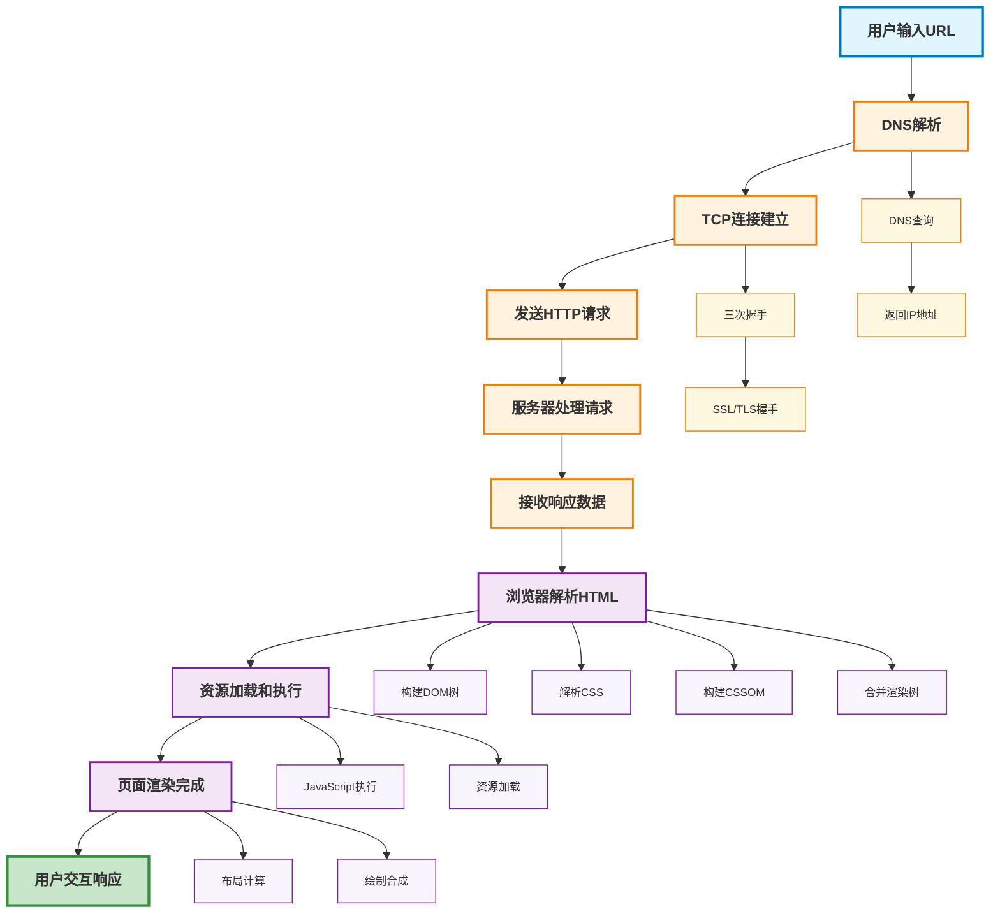
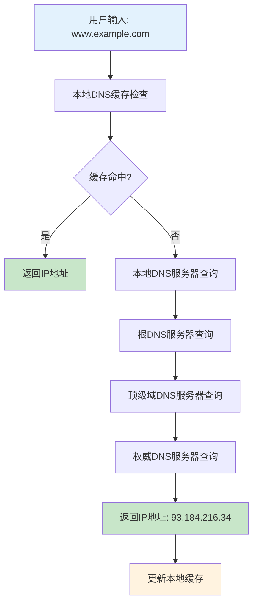
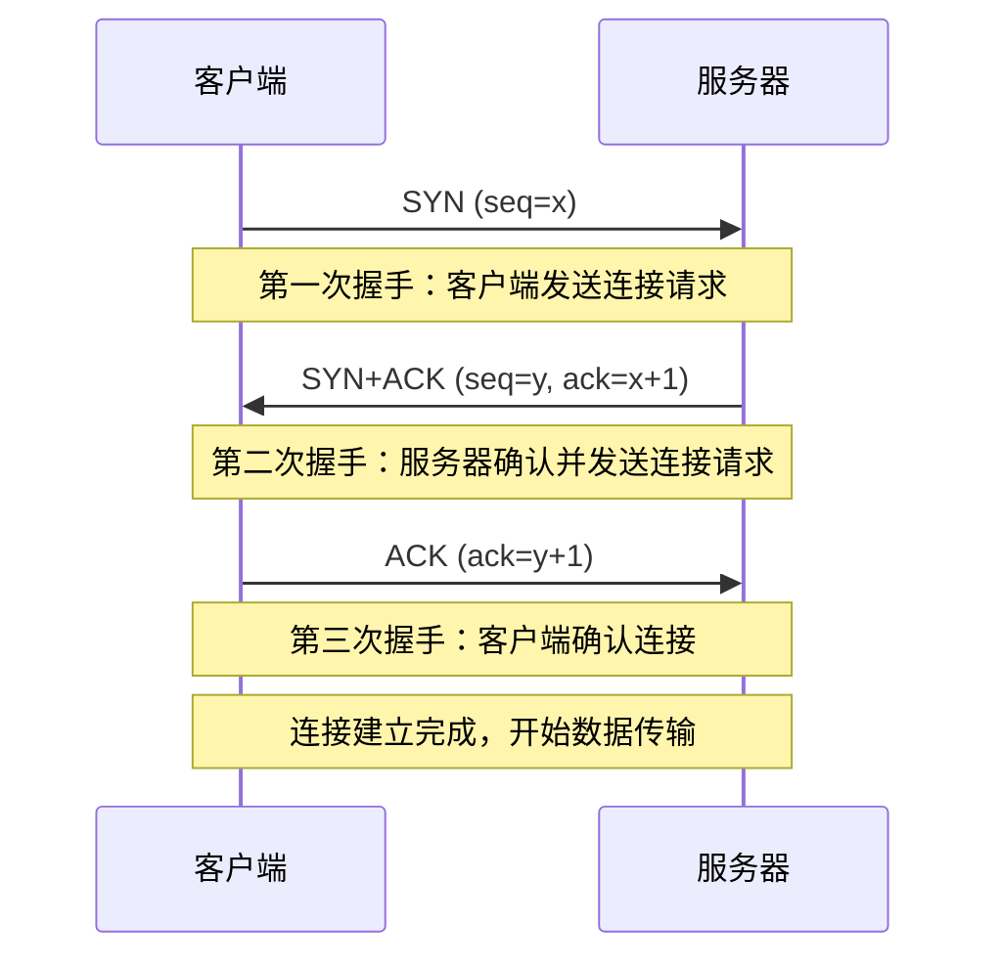
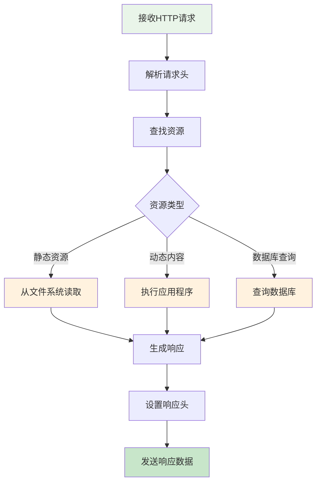
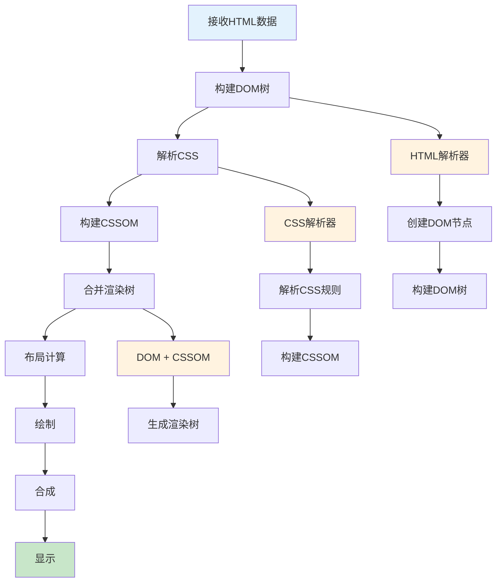
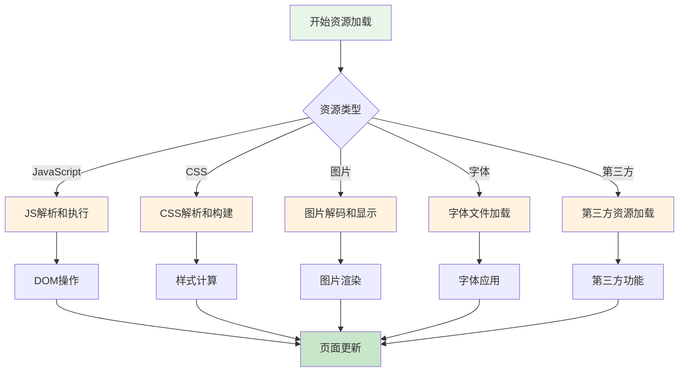
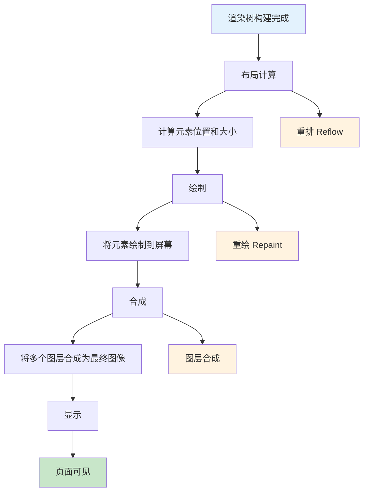
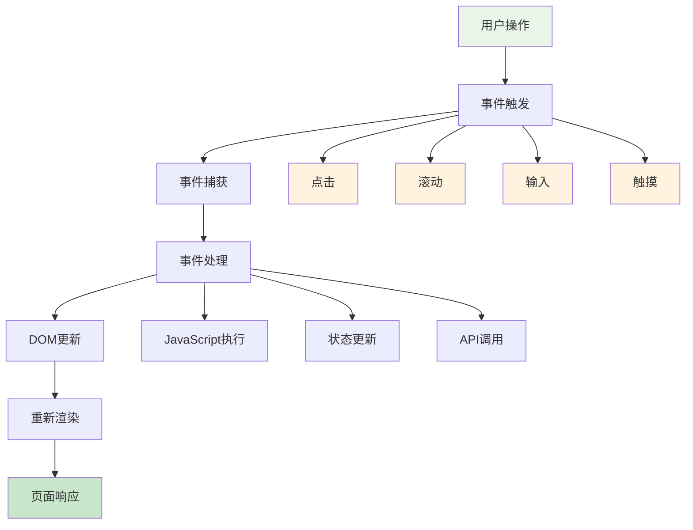
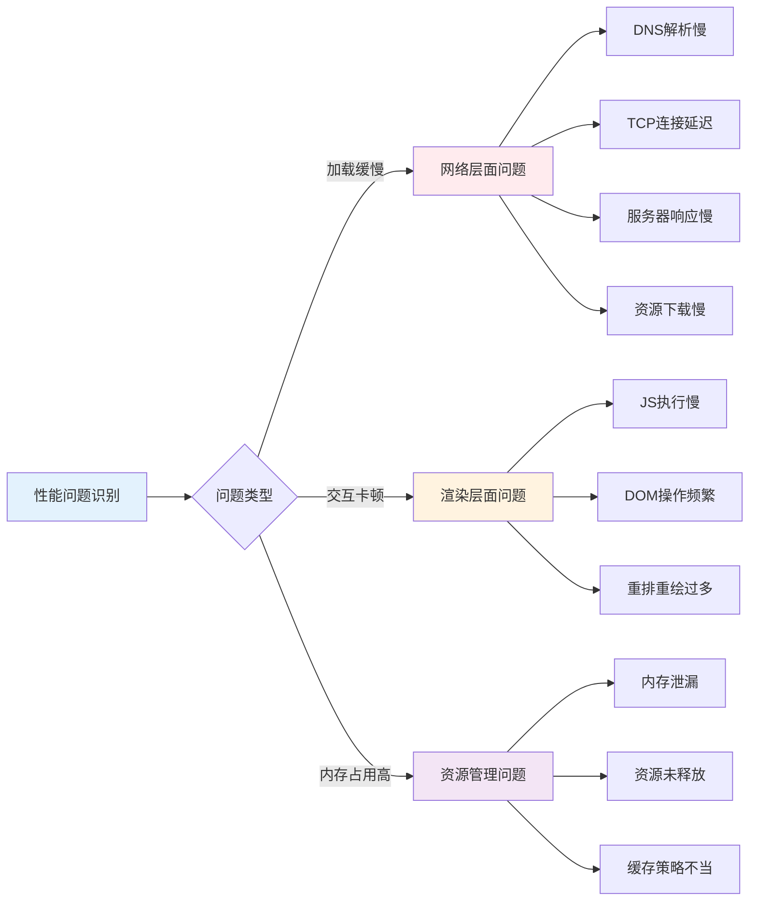

# 从URL到页面加载完成的过程

## 📚 学习指导

**本章重点**：理解浏览器从接收URL到页面完全加载的完整流程，为性能优化打下理论基础。

**学习目标**：
- 掌握页面加载的各个阶段和关键节点
- 理解浏览器渲染机制和阻塞原理
- 识别性能优化的关键时机和优化点

**前置知识**：建议先阅读 [性能优化整体思路](./overview.md) 建立全局认知。

**后续学习**：掌握页面加载原理后，建议学习 [用户角度的性能指标](./user-metrics.md) 了解如何衡量这些过程。

## 页面加载的完整流程

当用户在浏览器地址栏输入URL并按下回车键时，一个复杂的页面加载过程就开始了。理解这个过程对于性能优化至关重要。

## 整体流程图



## 1. 输入URL阶段

### 用户行为
- 用户在地址栏输入URL
- 按下回车键或点击跳转
- 浏览器开始处理请求

### 浏览器处理
- 解析URL格式
- 检查是否为有效URL
- 准备发起网络请求

## 2. DNS解析阶段

### DNS查询流程图



### 性能影响
- DNS查询时间：通常50-200ms
- 移动网络下可能更长
- 首次访问无缓存，后续访问有缓存

### 优化策略
- DNS预解析
- 使用CDN
- 减少域名数量

## 3. TCP连接建立

### 三次握手流程图



### 连接类型
- **HTTP/1.1**: 每个域名最多6个并发连接
- **HTTP/2**: 多路复用，单个连接处理多个请求
- **HTTPS**: 额外的TLS握手过程

### 性能影响
- TCP连接建立：通常100-300ms
- HTTPS额外开销：200-400ms
- 移动网络延迟更高

## 4. 发送HTTP请求

### 请求组成
```
GET /index.html HTTP/1.1
Host: www.example.com
User-Agent: Mozilla/5.0...
Accept: text/html,application/xhtml+xml...
Accept-Encoding: gzip, deflate
Accept-Language: zh-CN,zh;q=0.9
Connection: keep-alive
```

### 请求优化
- 减少请求头大小
- 使用HTTP/2压缩
- 合并小请求

## 5. 服务器处理请求

### 服务器处理流程图



### 处理时间影响因素
- 服务器性能
- 数据库查询复杂度
- 缓存命中率
- 服务器负载

### 优化方向
- 服务器端缓存
- 数据库优化
- 负载均衡
- 静态资源CDN

## 6. 接收响应数据

### 响应结构
```
HTTP/1.1 200 OK
Content-Type: text/html; charset=utf-8
Content-Length: 1234
Cache-Control: max-age=3600
Date: Mon, 23 May 2023 22:38:34 GMT

<!DOCTYPE html>
<html>
<head>...</head>
<body>...</body>
</html>
```

### 数据传输
- 分块传输
- 流式处理
- 压缩解压

## 7. 浏览器解析HTML

### HTML解析流程图



### 关键节点
- **DOMContentLoaded**: DOM树构建完成
- **CSSOM构建**: 样式计算完成
- **渲染树合并**: 准备开始渲染

### 阻塞资源
- 外部CSS文件
- 内联JavaScript
- 外部JavaScript文件

## 8. 资源加载和执行

### 资源加载流程图



### JavaScript执行
- 解析JavaScript代码
- 创建执行上下文
- 执行代码逻辑
- 操作DOM和CSSOM

### 图片和媒体资源
- 异步加载图片
- 视频和音频预加载
- 字体文件加载

### 第三方资源
- 分析脚本
- 广告代码
- 社交分享按钮

## 9. 页面渲染完成

### 渲染阶段流程图



### 关键指标
- **First Paint (FP)**: 首次绘制
- **First Contentful Paint (FCP)**: 首次内容绘制
- **Largest Contentful Paint (LCP)**: 最大内容绘制
- **Time to Interactive (TTI)**: 可交互时间

## 10. 用户交互响应

### 交互处理流程图



### 交互处理
- 事件监听器绑定
- 用户输入响应
- 页面状态更新

### 性能要求
- 输入延迟 < 100ms
- 动画流畅度 60fps
- 页面滚动流畅

## 性能瓶颈分析

### 常见瓶颈点流程图



### 常见瓶颈点
1. **DNS解析**: 首次访问无缓存
2. **TCP连接**: 移动网络延迟高
3. **服务器响应**: 后端处理慢
4. **资源加载**: 大文件下载慢
5. **JavaScript执行**: 主线程阻塞
6. **渲染计算**: 复杂布局计算

### 优化优先级
1. 减少关键资源数量
2. 优化关键渲染路径
3. 减少主线程工作量
4. 优化资源加载策略

## 📚 学习总结

### 关键知识点回顾
1. **网络阶段**：DNS解析 → TCP连接 → HTTP请求 → 响应接收
2. **解析阶段**：HTML解析 → DOM构建 → CSS解析 → CSSOM构建
3. **渲染阶段**：渲染树合并 → 布局计算 → 绘制合成 → 显示完成

### 性能优化关键点
- **DNS优化**：减少DNS查询时间
- **连接优化**：复用TCP连接，启用HTTP/2
- **资源优化**：减少阻塞资源，优化加载顺序
- **渲染优化**：减少重排重绘，优化JavaScript执行

### 面试重点 🔥
- 页面加载的完整流程
- 关键渲染路径和阻塞原理
- 各阶段的时间消耗和优化策略

## 🚀 下一步学习

理解了页面加载原理后，您已经掌握了性能优化的理论基础。接下来建议学习：

**[用户角度的性能指标](./user-metrics.md)** - 了解如何从用户体验角度衡量页面性能，掌握Core Web Vitals等关键指标。

这些指标将帮助您：
- 量化页面性能表现
- 识别具体的性能问题
- 制定针对性的优化策略 